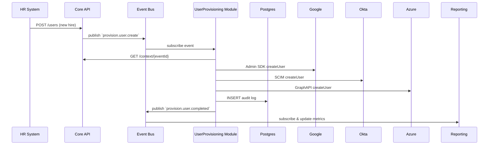

# AtlasIT Development Guide

Comprehensive blueprint for developing AtlasIT, a modular, cloud-first IT management platform tailored to SMBs. Includes architecture, development roadmap, repository structure, CI/CD, security, observability, and automated agent tasks.

---

## 1. Project Overview & Goals

* **Purpose**: Deliver a turnkey IT backbone for SMBs lacking full IT teams.
* **Scope**: User provisioning, SaaS account management, identity management, infrastructure access, device enrollment, communications orchestration, EDR/SIEM integration, reporting, and cost monitoring.
* **Success Criteria**:

  * 99.9% uptime across all MCP modules
  * Automated onboarding/offboarding in <60s per user
  * Compliance reporting for GDPR/CCPA
  * Monthly cloud spend alerts and cost dashboards

---

## 2. Architecture & Data Flow

### 2.1 Logical Layers

1. **Core API**: Node.js/TypeScript, Express + JWT/RBAC
2. **Event Bus**: Pub/Sub (GCP) or Kafka (self-hosted)
3. **MCP Modules**: Event-driven microservices, REST/gRPC endpoints
4. **Data Stores**: PostgreSQL primary, Firestore optional, Time-series (Prometheus)
5. **UI Dashboard**: React + Tailwind, served via Next.js or static S3/CloudFront
6. **Infra-as-Code**: Terraform for AWS WorkSpaces, GCP project & IAM, Kubernetes clusters

### 2.2 Sequence



---

## 3. Repository Structure & Files

```
atlasit/
├── .github/workflows/            # CI/CD pipelines
│   ├── ci-prereq.yml            # Mistral install & Terraform init/apply
│   ├── ci-urgent.yml            # Connection checks & stubs
│   ├── ci-dev.yml               # Module builds & stub functions
│   ├── ci-scans.yml             # Checkov, tfsec, ESLint, tflint
│   ├── smoke-test.yml           # smoke_test.sh
│   └── prod-deploy.yml          # Blue/Green deploy
├── docs/
│   ├── architecture.md          # Logical & physical diagrams
│   ├── config.md                # Env vars, secrets management
│   ├── integrations.md          # Detailed connector guides
│   ├── idp.md                   # OIDC/SAML setup & management
│   ├── provisioning-workflow.md # End-to-end sequence & APIs
│   ├── reporting.md             # Queries, dashboards, compliance
│   ├── security.md              # Threat model & hardening steps
│   ├── observability.md         # Logging, metrics, SLOs, runbooks
│   ├── contributing.md          # PR, coding standards, governance
│   └── roadmap.md               # Feature milestones & timelines
├── services/
│   ├── core/                    # Core API service
│   ├── mcp/
│   │   ├── user-provisioning/
│   │   ├── saas-account/
│   │   └── ... (all 10 modules)
│   └── ui/                      # Dashboard code
├── scripts/                     # zsh scripts with guardrails
│   ├── check-jira-connection.sh
│   ├── check-okta-connection.sh
│   ├── init-schema.sh
│   └── smoke_test.sh
├── terraform/                   # Infra modules
│   ├── aws/
│   │   └── workspaces/
│   ├── gcp/
│   │   └── project-setup/
│   └── modules/
│       ├── iam/
│       ├── network/
│       └── budget-alerts/
├── .env.example
├── README.md
├── package.json
└── tsconfig.json
```

---

## 4. Development Roadmap & Milestones

| Phase          | Duration  | Deliverables                                      |
| -------------- | --------- | ------------------------------------------------- |
| Prereq         | 1 week    | Mistral install, Terraform scaffold, project init |
| Urgent         | 1 week    | Connection checks, schema init, UI stub           |
| Module Dev     | 2–3 weeks | All 10 MCP modules implemented with tests         |
| CI Integration | 1 week    | Workflows, scans, lint, smoke tests               |
| Docs & O11y    | 1 week    | Complete docs, observability, runbooks            |
| Manual Review  | 2 days    | Security review, performance testing              |
| Prod Deploy    | 2 days    | Blue/Green rollout                                |

---

## 5. Detailed Documentation Outlines

### 5.1 docs/security.md

* Threat model diagram
* OWASP, CIS Benchmarks
* Secrets management via Vault/GCP Secret Manager
* Least privilege IAM policies
* Network segmentation (VPC, Firewalls)

### 5.2 docs/observability.md

* Logging: structure, correlation IDs
* Metrics: Prometheus schemas, Grafana dashboards
* SLO definitions and alert rules
* Runbook templates

### 5.3 docs/roadmap.md

* Q1: Core & provisioning MVP
* Q2: All MCP modules + reporting
* Q3: Local self-host option + IdP
* Q4: Advanced analytics & AI suggestions

---

## 6. Automated Agent Tasks & Prompts

### 6.1 Codex GPT (Code Generation)

1. **Generate MCP Module Template**

   * Prompt: "Create a new MCP module scaffold named `<module-name>` in TypeScript, including `handler.ts`, `api.ts`, `schema.json`, `Dockerfile`, and unit test stub."
2. **Write Connector Code**

   * Prompt: "Implement the `createUser` function for the User Provisioning MCP using the Google Admin SDK, handling pagination and errors."
3. **Terraform Module**

   * Prompt: "Generate a Terraform module for AWS WorkSpaces that creates a directory, security groups, and a parameterized WorkSpace resource."
4. **CI Workflow YAML**

   * Prompt: "Produce a GitHub Actions YAML for `ci-mcp-build.yml` that lints, type-checks, and validates JSON schemas."

### 6.2 Operator GPT (Orchestration & Ops)

1. **Run Connectivity Checks**

   * Task: invoke `check-okta-connection.sh`, parse output, and create a Jira ticket if failures detected.
2. **Deploy MCP Module**

   * Task: on code merge, trigger `ci-mcp-deploy.yml` and report status in Slack channel.
3. **Smoke Testing**

   * Task: execute `smoke_test.sh`, collect metrics, and update health dashboard.
4. **Cost Alerting**

   * Task: daily ingest AWS/GCP cost data, compare against thresholds, and send email/SMS on overrun.
5. **Documentation Sweep**

   * Task: weekly check for out-of-date docs via Confluence API and open PRs for stale files.

---

## 7. Next Steps

1. Review this guide and adjust timelines or module priorities.
2. Kick off the Prereq phase: Mistral & Terraform scaffold.
3. Assign Codex GPT tasks to generate initial scaffolding code.
4. Setup Operator GPT runbooks for environment validation and deploy checks.

*End of AtlasIT Development Guide.*
