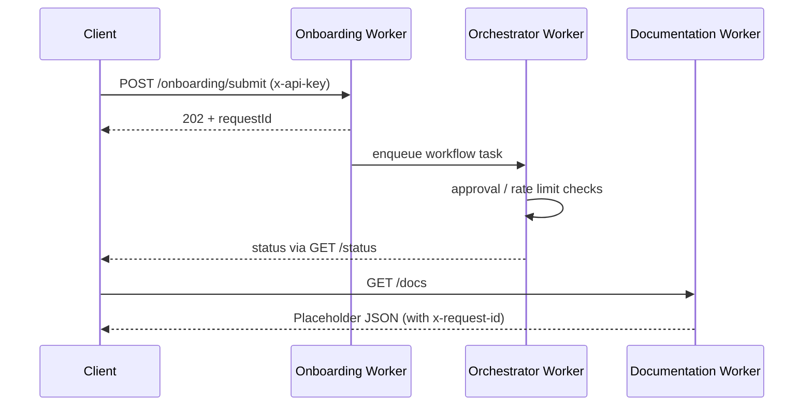

# AtlasIT Development Guide

This guide documents the architecture, repository layout, and day-to-day engineering practices for the AtlasIT platform. It reflects the current deployment focus: three Cloudflare Workers (onboarding, orchestrator, documentation) plus the shared TypeScript package that binds them together.

---

## 1. Platform Overview

- **Mission**: deliver a lightweight IT operations backbone for SMBs by automating onboarding, workflow orchestration, and evidence capture.
- **Scope**: Cloudflare Workers, TypeScript packages, Terraform/bootstrap tooling, and operational documentation contained in this repository.
- **Success Criteria**:
  - Ship production-ready versions of the three active workers.
  - Maintain passing `npm run predeploy` gates (env validation, typecheck, tests, secrets scan).
  - Capture deploy readiness and endpoint changes in `ops/DEPLOYMENT_READINESS_SUMMARY.md` and `ops/ENDPOINTS.md`.

---

## 2. Architecture Snapshot

### 2.1 Logical Components

1. **Onboarding Worker** – Serves `/onboarding/*` routes, generates dynamic questionnaires, and persists tenant state to KV/D1.
2. **AI Orchestrator Worker** – Coordinates background tasks, runs approval hooks, and rate-limits automation endpoints.
3. **Documentation Worker** – Exposes `/health` and `/docs` JSON endpoints (staging area for published docs).
4. **Shared Library (`@atlasit/shared`)** – Provides logging, environment validation, AI helpers, and HTTP utilities used by every worker.

### 2.2 Request Flow (Simplified)



---

## 3. Repository Structure

```text
atlasit/
├── ai-orchestrator/           # Orchestrator worker source & tests
├── onboarding/                # Onboarding worker source & tests
├── documentation-worker/      # Documentation worker source & tests
├── packages/shared/           # Shared TypeScript utilities
├── ops/                       # Operational docs (endpoints, readiness, secrets)
├── scripts/                   # Validation & deployment helpers
└── docs/                      # Reference documentation (roadmap, architecture)
```

Legacy directories such as `marketplace/`, `auth/`, `applications/`, and `api-manager/` remain for future work but are not built or deployed today. See [`LEGACY.md`](LEGACY.md) for archived context.

---

## 4. Development Workflow

### 4.1 Environment Setup

```bash
npm install
cp .env.example .env
npm run validate:env
```

Populate `.env` (or secrets) with the values listed in `ops/DEPLOYMENT_SECRETS_CHECKLIST.md`. The validation script loads `.env` automatically before checking required keys.

### 4.2 Running Workers Locally

Use Wrangler dev commands exposed through npm scripts:

```bash
npm run dev:onboarding
npm run dev:orchestrator
npm run dev:docs
```

`npm run dev:core` starts onboarding and orchestrator together for integration testing.

### 4.3 Testing & Quality Gates

| Command                | Description                                                                            |
| ---------------------- | -------------------------------------------------------------------------------------- |
| `npm run validate:env` | Ensures required env vars exist (prefers `CLOUDFLARE_API_TOKEN`).                      |
| `npm run typecheck`    | Type checks active workers/packages with strict settings.                              |
| `npm run test:unit`    | Runs Vitest suites across onboarding, orchestrator, shared, and documentation workers. |
| `npm run predeploy`    | Executes the three commands above sequentially.                                        |

CI workflows call `validate:env` early using seeded dummy API keys to enforce parity with local expectations.

---

## 5. Current Deployment Focus

Near-term engineering priorities:

1. **Durable Workflow Persistence** – Back orchestration state with Durable Objects or KV to survive isolate restarts.
2. **Observability Metrics** – Capture latency distribution, request counts, and error rates for each worker.
3. **Test Coverage Improvements** – Increase Vitest coverage thresholds once persistence lands.
4. **Deployment Automation** – Finalise a production runbook with smoke tests and rollback guidance (see README deployment section).

Track progress and outstanding gaps in `ops/DEPLOYMENT_READINESS_SUMMARY.md` and `ops/ENDPOINTS.md`.

---

## 6. References & Further Reading

- [`README`](README.md) – High-level overview, quick start, deployment steps.
- [`ops/ENDPOINTS.md`](ops/ENDPOINTS.md) – API catalogue for active workers.
- [`ops/DEPLOYMENT_READINESS_SUMMARY.md`](ops/DEPLOYMENT_READINESS_SUMMARY.md) – QA status and follow-up items.
- [`docs/roadmap.md`](docs/roadmap.md) – Time-phased roadmap with planned initiatives.
- [`LEGACY.md`](LEGACY.md) – Archived legacy details kept for posterity.

Contributions should run `npm run predeploy` locally before opening a pull request.
