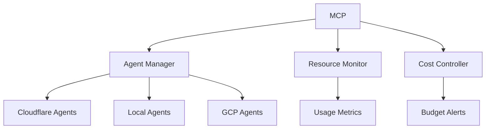

# Project Ignite - Centralized Documentation

## Project Overview
Project Ignite is an autonomous DevSecOps platform that orchestrates contractor lifecycle, security remediation, license management, and AI model training within a $400/month budget.

## Core Components

### 1. Master Control Program (MCP)
- **Location**: Cloudflare Workers
- **Role**: Central orchestrator for all AI agents and resources
- **Functions**:
  - Agent lifecycle management
  - Resource allocation and monitoring
  - Cost control and budget management
  - Cross-platform orchestration

### 2. AI Agents
- **Types**:
  - Documentation Agent (Cloudflare Workers)
  - Security Agent (Local iMac)
  - ETL Agent (GCP Cloud Functions)
  - Training Agent (GCP AI Platform)
- **Resource Distribution**:
  - Cloudflare Workers (free tier)
  - Local iMac (heavy compute)
  - GCP (ETL, training)
  - OpenAI API (advanced tasks)

### 3. Resource Management
- **Cloudflare Workers**:
  - Free tier limits
  - Usage monitoring
  - Auto-scaling
- **Local iMac**:
  - CPU/Memory monitoring
  - Task distribution
  - Resource optimization
- **GCP Resources**:
  - Cloud Functions
  - BigQuery
  - Firestore
  - AI Platform

### 4. Cost Control
- **Budget**: $400/month
- **Monitoring**:
  - Real-time cost tracking
  - Usage alerts
  - Auto-termination of expensive resources
- **Optimization**:
  - Caching strategies
  - Resource pooling
  - Load balancing

## System Architecture

### 1. MCP Core

### 2. Agent Communication
- **Protocol**: MCP Protocol
- **Transport**: WebSocket/SSE
- **Authentication**: OIDC
- **State Management**: Durable Objects

### 3. Resource Allocation
- **Priority**:
  1. Free tier resources
  2. Local compute
  3. Paid services
- **Scaling**:
  - Auto-scale based on load
  - Cost-aware distribution
  - Performance optimization

## Implementation Status

### Current Phase
- MCP deployment in Cloudflare
- Agent framework setup
- Resource monitoring implementation

### Next Steps
1. Deploy MCP to Cloudflare Workers
2. Set up local agent runner
3. Implement resource monitoring
4. Configure cost controls

## Documentation Updates
This document is automatically updated by the Documentation Agent. Last update: [TIMESTAMP]

## Resource Limits

### Cloudflare Workers
- Requests: 100,000/day
- Memory: 128MB/request
- CPU: 50ms/request

### Local iMac
- CPU: 80% max
- Memory: 16GB max
- Disk: 256GB max

### GCP
- Cloud Functions: 2GB memory
- BigQuery: 1TB/month
- Firestore: 50GB storage

## Cost Allocation
- Cloudflare: $0 (free tier)
- GCP: $200/month
- OpenAI: $100/month
- Buffer: $100/month

## Contact
- Owner: Joe Whittle (joe.whittle@flosports.tv)
- Infra Manager: Jordan Garrison
- IT Admins: Zach Hughes, Morgan Manns 