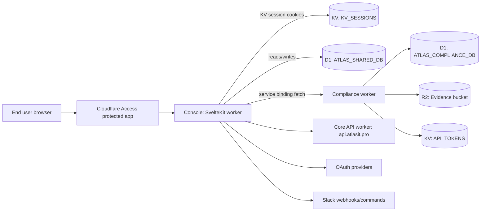
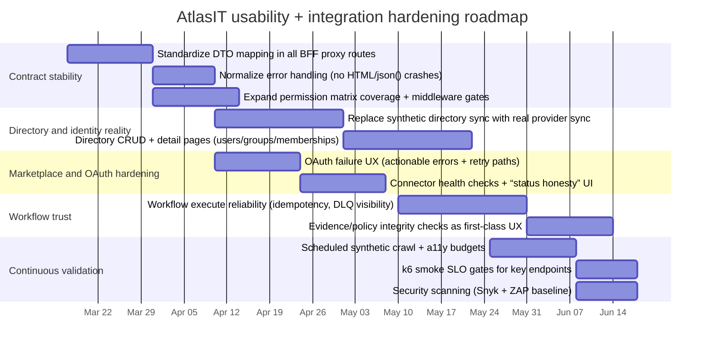

# AtlasIT.pro Platform Usability and Integration Automation Research

## Executive summary

AtlasIT is implemented as a Cloudflare-first, multi-worker platform with a SvelteKit console (“console-app”) acting as both UI and a backend-for-frontend (BFF) layer, plus dedicated Workers for compliance workflows, onboarding, and AI-related orchestration. The repo is a pnpm monorepo and already includes Playwright-based full-site crawling and accessibility checks, plus guardrails for role-based access on many API routes. fileciteturn37file0L1-L1 fileciteturn59file0L1-L1 fileciteturn35file0L1-L1

The most important “real usability” story (as of the current code) is that several high-value flows are either partially implemented, synthetic/demo-driven, or gated by missing bindings/secrets. The directory sync endpoint, for example, explicitly generates synthetic users/groups and returns “Real IdP sync not yet implemented” for non-synthetic mode even when a provider token exists—meaning a large part of the promise (“connect your IdP, sync users/groups, automate JML”) is not yet real for production tenants. fileciteturn89file0L1-L1

Because of that, the best automation strategy for AtlasIT right now is less about maximizing “more tests,” and more about: (a) mapping and hardening the platform’s real functional contracts between the console BFF and the Workers it proxies to, (b) instrumenting and continuously validating the end-to-end user journeys that define usability (login → dashboard → connect directory → connect apps → run workflow → view evidence/compliance), and (c) prioritizing integration correctness (OAuth, credential storage, RBAC decisions, audit log consistency, DTO casing) to eliminate user-facing breakage. fileciteturn53file0L1-L1 fileciteturn64file0L1-L1

A key constraint: I could not directly crawl `https://www.atlasit.pro/` from here due to repeated fetch failures (“Cache miss”), so the “crawl map” below is derived from (1) Workers routing configs, (2) SvelteKit route handlers/pages, and (3) the repo’s own Playwright crawl tests. Treat it as “what production should expose if deployed as configured,” and verify against your live environment with the included crawl/synthetic-monitor approach. fileciteturn35file0L1-L1 fileciteturn19file0L1-L1

## Platform architecture and functional map

### Component topology

AtlasIT is deployed primarily on entity["company","Cloudflare","internet infrastructure company"] using Workers (and a SvelteKit console configured for Workers/Pages-style runtime bindings), with multiple Workers bound together via service bindings (notably the console → compliance-worker binding). Cloudflare service bindings allow one Worker to invoke another Worker’s `fetch()` directly without a public hop, which matches the console’s `env.COMPLIANCE_WORKER.fetch()` proxy pattern. fileciteturn65file0L1-L1 citeturn11search1turn11search6

At a high level:



This decomposition is directly supported by the wrangler configs: the console Worker binds D1 + KV + a `COMPLIANCE_WORKER` service; the compliance Worker binds D1 + R2 + KV; and the root/core Workers route traffic on `api.atlasit.pro`. fileciteturn35file0L1-L1 fileciteturn36file0L1-L1 fileciteturn34file0L1-L1

### Routes and subdomains derived from deployment config

The repo’s wrangler routing indicates a multi-subdomain platform shape (console + API + compliance + orchestrator), with many console APIs served on `www.atlasit.pro` under `/api/*` and the console UI served under `/console*`. fileciteturn35file0L1-L1

A compact map of “what should exist” based on wrangler routing and SvelteKit endpoints:

| Surface | Intended base | Primary owner | What it does |
|---|---|---|---|
| Console UI | `www.atlasit.pro/console/*` | console-app | Tenant & platform dashboards, directory, marketplace, workflows, settings. fileciteturn56file0L1-L1 |
| Console BFF APIs | `www.atlasit.pro/api/*` | console-app | Proxies/aggregates to compliance/core services; enforces RBAC; maps DTO casing; writes audit logs. fileciteturn23file0L1-L1 fileciteturn64file0L1-L1 |
| Compliance worker | `compliance.atlasit.pro/*` and `www.atlasit.pro/api/compliance/*` | compliance-worker | Compliance snapshot, evidence ingest/verify/search, policy templates/generate/evaluate/coverage, incidents, access requests, notifications, workflow execute/executions. fileciteturn36file0L1-L1 fileciteturn50file0L1-L1 |
| Core API worker | `api.atlasit.pro/*` | root worker / core-api | Application catalog, lifecycle workflow definitions, integrations registry, dispatch namespace plumbing. fileciteturn34file0L1-L1 citeturn11search0turn11search8 |
| Slack callbacks | `www.atlasit.pro/api/slack/*` | console-app | Slash commands/events/interactions endpoints + signature verification. fileciteturn76file0L1-L1 fileciteturn78file0L1-L1 |

The repo also includes a separate “core-api” package deployed to `api.atlasit.pro/api/*` (note the extra `/api` prefix in the route config), which is a potential usability risk if clients and UI disagree on base paths. In practice, the console’s `coreFetch()` uses `CORE_API_BASE=https://api.atlasit.pro` and requests `/api/v1/...`, which aligns with the root worker shape more than the `core-api` worker route prefix. fileciteturn62file0L1-L1 fileciteturn86file0L1-L1 fileciteturn85file0L1-L1

### Authentication and session model

The console enforces an auth flow anchored in Cloudflare Access: it reads `cf-access-jwt-assertion` and `cf-access-authenticated-user-email` headers, resolves the identity via configured providers, and creates an application session stored in KV with cookies such as `atlas_session`. A development bypass exists (`DEV_AUTH_BYPASS`) for local work. fileciteturn24file0L1-L1 fileciteturn22file0L1-L1

Cloudflare recommends validating the `Cf-Access-Jwt-Assertion` header (rather than relying only on the authorization cookie), and that validation depends on your Access signing keys served from your team domain. Access signing keys rotate periodically, which can become a “surprise break” if you hard-pin keys without refresh automation. citeturn11search2turn11search9

For the compliance service, auth is not Cloudflare Access—API calls are authenticated via an `x-api-key` header, hashed and looked up in a KV namespace (`API_TOKENS`), and then authorized by roles embedded in the token record. fileciteturn52file0L1-L1 fileciteturn36file0L1-L1

This dual-model (human UI via Access; service API via API keys) is valid, but it has a direct usability impact: users will experience different failure modes and error messages depending on whether the console route or the upstream worker is failing auth. The BFF layer must normalize these into “actionable” UI errors (not raw 401/403/HTML). fileciteturn64file0L1-L1 fileciteturn50file0L1-L1

### Core user-facing features and their implementation maturity

#### Marketplace and app connections

The Marketplace page fetches the tenant’s connected app status from `/api/apps/status`, supports “credential-based” connects via `/api/apps/connect`, supports OAuth-based connects via `/api/apps/oauth/start` → `/api/apps/oauth/callback`, and supports disconnect via `/api/apps/disconnect`. Planned integrations are displayed but the “Connect” button is disabled with “Coming Soon,” which is a direct usability win versus letting users start a dead-end wizard. fileciteturn68file0L1-L1 fileciteturn70file0L1-L1

Credential storage is done in D1 with AES-256-GCM encryption when `CRED_ENCRYPTION_KEY` is configured; without the secret, credentials are stored as plaintext JSON (“dev mode”). From a usability standpoint, plaintext fallback is fine in local dev, but in prod it’s a critical trust/compliance hazard: a single misconfigured secret silently downgrades your security posture. fileciteturn72file0L1-L1

OAuth initiation stores a CSRF `state` cookie (`oauth_state`) containing `{state, appId, tenantId}`, then redirects to the provider authorize URL. Callback validates state, exchanges the code for tokens, stores tokens (encrypted), and writes an audit log event. fileciteturn73file0L1-L1 fileciteturn74file0L1-L1

The repo includes explicit OAuth provider configurations for services including Google Workspace, Microsoft 365/Azure/Teams, GitHub, Slack, Atlassian Jira/Confluence, Okta/Auth0/Workday (tenant-domain), and others. fileciteturn75file0L1-L1 entity["company","Google","technology company"] entity["company","Microsoft","technology company"] entity["company","Okta","identity management company"] entity["company","Atlassian","software company"] entity["company","Slack","workplace messaging company"] entity["company","GitHub","code hosting company"]

#### Directory connection and sync

Directory “connect” supports providers `okta`, `google_workspace`, `microsoft_365`, records a `directory_connections` row, and (for Okta) stores a domain credential into `app_credentials`. fileciteturn90file0L1-L1

Directory “sync,” however, is currently synthetic: it generates a fixed set of users/groups/memberships and upserts them into D1. If a real provider token exists and you are not in synthetic mode, the endpoint returns `501 Real IdP sync not yet implemented`. It also auto-suggests group→app mappings using regex patterns (Engineering → GitHub/Jira, etc.). fileciteturn89file0L1-L1

This has a major usability implication: the UI may look functional, but real-world tenants won’t see their real org structure without additional implementation work.

#### Workflows and JML automation

The Workflows UI lists connected apps, fetches lifecycle workflow definitions via `/api/apps/lifecycle/workflows` (proxied to the “core” API base), and executes workflows via `/api/workflows/execute` (proxied to compliance-worker `/api/v1/workflows/execute`). fileciteturn84file0L1-L1 fileciteturn85file0L1-L1 fileciteturn88file0L1-L1

The repo contains JML workflow YAML that is notably detailed for “real orchestration” (idempotency keys, approvals below confidence thresholds, evidence emission, compensation steps). For example, the Okta joiner workflow defines AI-assisted access bundle resolution, approval steps, and evidence/control updates. This is a core value surface worth validating continuously because it directly impacts operator trust. fileciteturn49file0L1-L1

#### Compliance, evidence, policies, incidents, access requests

The compliance worker implements a broad API surface including:

- Evidence ingest/search/get/verify (with canonical JSON hashing and R2 storage),
- Policy template listing, generation (optionally using `GROQ_API_KEY`), evaluation, and coverage,
- Incident create/list/resolve,
- Access request create/list/transition,
- Notifications list/mark read,
- Activity feed. fileciteturn50file0L1-L1

This worker also exposes a `/health` response with operational fields (evidence count, incident threat level, pending requests, latency summaries), which can become the backbone of synthetic “does it feel alive?” checks and user-visible status accuracy. fileciteturn50file0L1-L1

#### Slack integration

Slack integration is wired to endpoints on `www.atlasit.pro/api/slack/*` (slash commands, events, interactions) and includes signature verification with replay protection (timestamp drift check) and timing-safe compare. The handlers themselves are still TODO stubs, but the security envelope is correct and matches Slack’s verification guidance. fileciteturn76file0L1-L1 fileciteturn79file0L1-L1 fileciteturn81file0L1-L1 citeturn13search0

## Usability and integration findings

### Critical usability failure modes are mostly “contract and wiring” issues

The repo’s own QA/RBAC plan calls out several usability-impacting defects whose root cause is “JSON shape mismatch” (snake_case from D1 rows vs camelCase expected by frontend types), missing routes, and missing/partial RBAC guards—i.e., not visual design problems so much as “platform contracts aren’t stable.” fileciteturn53file0L1-L1

From a user’s perspective, these manifest as:

- Blank subjects/dates (“Invalid Date”) on incidents and access requests,
- 404s from dashboard links (e.g., API Manager route missing at some point),
- “connectors” that allow interaction even though they are planned,
- Health/status screens that can be “green” while functionality is broken (reachability vs correctness). fileciteturn53file0L1-L1

The console BFF already implements DTO mapping in some places (example: access requests mapping `subject_ref`→`subject` and `created_at`→`createdAt`)—which is exactly the right pattern to make the UI stable even if upstream storage is not. The platform should standardize this across all BFF proxy routes. fileciteturn64file0L1-L1

### Directory usability is currently “demo-grade” by design

Directory “connect” exists, but directory “sync” explicitly uses synthetic data and does not implement real IdP sync yet. This is the highest-leverage usability gap because many other parts of the product (group→app mappings, JML triggers) assume real directory data. fileciteturn90file0L1-L1 fileciteturn89file0L1-L1

### OAuth onboarding is functional but needs “usability-hardening”

OAuth flows are implemented with state cookies, provider-specific token exchange handling (including Slack/GitHub special cases), encrypted token storage, and audit logging. That’s the core technical correctness. fileciteturn73file0L1-L1 fileciteturn74file0L1-L1 fileciteturn72file0L1-L1

The usability risk is that OAuth failures are common in real environments (misconfigured redirect URLs, missing secrets, tenant-domain mistakes). The current implementation redirects to Marketplace with an encoded error string; you should standardize these into “user-actionable” messages aligned with usability heuristics like “help users recognize, diagnose, and recover from errors.” citeturn19view0

### RBAC and multi-tenant boundaries are part of usability, not just security

If an “admin-only” action fails with a generic 500 or the UI renders buttons that the user can never successfully use, usability is broken even if security is technically correct. The console includes a central permission matrix (`matchRoutePermission`) for many API routes and checks them in the middleware; expanding this until “every mutation route is guarded” will reduce user confusion and supportability load. fileciteturn23file0L1-L1 fileciteturn24file0L1-L1

### Observability and “status honesty” are core UX

Workers observability (log persistence and sampling) is enabled in multiple wrangler configs, and Cloudflare documents observability controls in Wrangler. Treat this as UX infrastructure: you can’t maintain usability without fast root-cause feedback loops. fileciteturn34file0L1-L1 fileciteturn36file0L1-L1 citeturn12search9

Also, AtlasIT uses serverless data stores (D1, KV, R2) where latency and consistency properties differ; you should explicitly test and communicate these in-user-facing ways (e.g., snapshot age, sync last-run). D1 is positioned as a serverless SQL database with built-in disaster recovery, and KV is designed for globally low-latency reads—these are strengths if you design the UX around them. citeturn11search4turn12search3

## Automation strategy and tool selection centered on usability and integration

This section intentionally emphasizes “platform usability validation” over “CI wiring,” per your direction.

### Quality pillars for AtlasIT

A practical, usability-first automation model for this platform:

- **Journey integrity**: can a tenant complete the core flows end-to-end (login → dashboard → directory connect/sync → app connect → workflow run → evidence/policy artifacts appear)?
- **Contract stability**: do BFF endpoints always return UI-shaped JSON, regardless of storage casing or upstream failure?
- **Trust signals**: does “Platform Status” reflect functional correctness (not only reachability)?
- **Accessibility by default**: do console routes meet WCAG expectations and avoid regressions?
- **Performance budgets**: does the console meet Core Web Vitals targets at the 75th percentile (LCP/INP/CLS)? citeturn14search0turn14search8

### Tooling comparison aligned to AtlasIT’s stack

AtlasIT is already set up for Playwright tests and includes an accessibility crawl test using axe, so the highest ROI is to expand/operationalize what’s already there. fileciteturn21file0L1-L1 fileciteturn19file0L1-L1 fileciteturn20file0L1-L1

| Need | Best-fit tool for AtlasIT | Why it fits this repo | Usability tie-in |
|---|---|---|---|
| End-to-end user journeys + route crawling | Playwright (existing) | Already configured (`playwright.config.ts`, global setup, full-site crawl). fileciteturn21file0L1-L1 | Captures broken routes, dead-end flows, regressions. citeturn14search7 |
| Component-level UI regressions | Cypress Component Testing (optional) | Works with Svelte component testing flows and is designed to simplify debugging UI units. citeturn21search5turn21search10 | Faster feedback on usability-critical components (forms, dialogs, tables). |
| Accessibility testing | axe (already used) + WCAG 2.2 tags | Repo uses `@axe-core/playwright` with WCAG tags. fileciteturn20file0L1-L1 | Prevents regressions that directly harm usability for users with disabilities. citeturn13search4turn13search1 |
| Load/performance validation | k6 | Scriptable load tests; CI-friendly; good for Worker endpoints and D1-backed APIs. citeturn21search1 | Protects “it feels fast” and reduces timeouts on core journeys. |
| Dependency vulnerability scanning | entity["company","Snyk","developer security company"] | Supports CLI + PR checks; good fit for node/pnpm monorepo scanning. citeturn21search2 | Breaks less often due to supply chain issues; security issues are usability issues once exploited. |
| Dynamic app security checks | entity["organization","OWASP","web security foundation"] ZAP | ZAP offers automation hooks and can augment browser flows (OWASP PTK via ZAP). citeturn21search0 | Finds auth/session and injection flaws that degrade trust and safety. |

### What to automate first for “actual usability”

Given the current implementation maturity, prioritize checks that validate *real user value* and detect the most common “broken platform” states:

- **Auth and session**: Access header presence → console session creation → redirect correctness for `/console/login` and protected routes. fileciteturn24file0L1-L1 citeturn11search2turn11search9
- **Dashboard truthfulness**: `/api/tenant/dashboard` returns consistent, non-crashing JSON even when D1 binding is missing (it has a fallback). fileciteturn57file0L1-L1
- **Marketplace connector usability**: planned connectors remain disabled; “Connect” requires required fields; OAuth failures show actionable messages. fileciteturn68file0L1-L1 fileciteturn73file0L1-L1
- **Directory reality check**: detect and clearly message synthetic-only behavior; if `Real IdP sync not yet implemented`, surface that as “Coming Soon” rather than a generic failure. fileciteturn89file0L1-L1
- **Workflow execution**: running `/api/workflows/execute` yields a structured result or a stable error; latency and failure reasons are visible. fileciteturn88file0L1-L1 fileciteturn50file0L1-L1
- **Evidence/policy artifacts**: evidence ingest → verify works, because this is the “trust anchor” for a compliance platform. fileciteturn50file0L1-L1

### Minimal, tailored example snippets (platform-focused)

These are intentionally “small” and oriented to validating usability and integration, not building a huge test suite.

#### Run the repo’s existing full-site crawl + accessibility scan against a deployed environment

The repo already contains a Playwright crawl test (`tests/full/site-crawl.spec.ts`) that walks internal links and runs axe checks. You can execute it against prod by setting `BASE_URL` (Playwright config supports `baseURL`). fileciteturn19file0L1-L1 fileciteturn21file0L1-L1

```bash
# Example: run crawl against prod console (adjust path if your console differs)
BASE_URL="https://www.atlasit.pro/console" pnpm playwright test tests/full/site-crawl.spec.ts
```

#### k6 smoke load for “does it feel alive?”

Use k6 to protect the “fast dashboard” experience by exercising the most important GETs at low concurrency with strict latency thresholds. k6 is designed for scriptable, automated load testing. citeturn21search1turn14search0

```javascript
// k6-smoke.js
import http from 'k6/http';
import { check, sleep } from 'k6';

export const options = {
  vus: 5,
  duration: '2m',
  thresholds: {
    http_req_failed: ['rate<0.01'],
    http_req_duration: ['p(95)<800'], // tighten once stable
  },
};

export default function () {
  const res = http.get('https://compliance.atlasit.pro/health');
  check(res, { 'health 200': (r) => r.status === 200 });
  sleep(1);
}
```

#### ZAP baseline scan for obvious web risks

ZAP is commonly used for automated dynamic application security testing; OWASP PTK also supports automation augmentation through ZAP. citeturn21search0

```bash
# Illustrative (tune context/auth if needed)
zap-baseline.py -t https://www.atlasit.pro -m 2 -r zap-report.html
```

## Implementation roadmap with milestones

This roadmap assumes the goal is **improving actual usability and integration reliability**, with automation used as continuous validation.

### Milestone intent

- Stabilize the contracts that users “feel” (DTO shapes, errors, reachability vs correctness).
- Make directory + app connections real (remove synthetic dependency for production tenants).
- Make workflow execution + evidence/proofs reliable and observable.
- Use automation to prevent regressions, not to compensate for missing functionality.

### Timeline



### Effort sizing (engineering reality)

- **DTO mapping + error normalization**: small/medium, but very high ROI because it eliminates “blank fields” and “random crashes” that users interpret as “untrustworthy platform.” fileciteturn53file0L1-L1
- **Directory real sync (Okta/Google/Microsoft)**: medium/large (OAuth scopes, rate limits, pagination, incremental sync, deprovisioning semantics). Your sync endpoint currently codifies the table shapes and the “suggested mappings” feature, so you have a clear target to replace synthetic generation with real ingestion. fileciteturn89file0L1-L1
- **Workflow trust improvements**: medium; you already have strong workflow specs (YAML) and an execution API—focus on operational transparency (execution history, DLQ surfacing, confidence thresholds). fileciteturn49file0L1-L1 fileciteturn50file0L1-L1
- **Continuous validation**: small to medium; the repo already has the seeds (crawl tests, a11y checks). fileciteturn19file0L1-L1

## Maintenance checklist and metrics to track

### Non-negotiable maintenance controls

- **Cloudflare Access key rotation readiness**: Access signing keys rotate; ensure validation logic (or libraries) fetch keys dynamically and tolerate rollover windows. citeturn11search2
- **Prod secret “must-exist” assertions**: treat missing `CRED_ENCRYPTION_KEY`, missing API keys, or missing D1 bindings as startup-failing misconfigurations (not silent fallbacks). Silent downgrade breaks trust. fileciteturn72file0L1-L1 fileciteturn53file0L1-L1
- **Cron/admin endpoint isolation**: the repo documents cron-managed admin endpoints guarded by an admin token; keep these behind internal-only access paths and verify they cannot be invoked by tenants. fileciteturn82file0L1-L1 citeturn12search2turn12search8
- **Slack webhook verification drift**: keep signature verification aligned with Slack’s published algorithm and replay window expectations. fileciteturn79file0L1-L1 citeturn13search0
- **R2 evidence durability controls**: evidence artifacts are “audit-grade” objects; implement deletion protections and access scoping (policy + bucket lock where applicable). R2’s durability is high, but accidental deletion is still on you. citeturn12search7

### Metrics that reflect usability (not just uptime)

Anchor these to SLOs and product acceptance:

- **Core Web Vitals (field)**: LCP ≤ 2.5s, INP ≤ 200ms, CLS ≤ 0.1 at p75 (mobile+desktop segmented). This is literal “how fast does it feel?” and should be tied to dashboard, marketplace, workflows, and directory pages. citeturn14search0turn14search8
- **Journey completion rates** (synthetic + real):  
  - login → dashboard success  
  - marketplace connect success (credential + OAuth)  
  - directory connect → sync success  
  - workflow execute success  
  - evidence ingest → verify success fileciteturn73file0L1-L1 fileciteturn89file0L1-L1 fileciteturn50file0L1-L1
- **Truthfulness of status screens**: “Platform Status” should reflect functional checks, not only reachability. (Reachability-only is explicitly called out as a partial fix in the QA plan.) fileciteturn53file0L1-L1
- **RBAC denial clarity**: count and classify 403s on console BFF routes; high rates often mean the UI is offering actions users can’t perform (bad UX), or roles aren’t assigned correctly. fileciteturn23file0L1-L1
- **Compliance worker health fields**: track evidence count, snapshot age, open incidents, pending access requests, latency summaries—these are already computed and can be promoted into dashboards and alerts. fileciteturn50file0L1-L1

### Usability heuristics as an operational tool

Use entity["organization","Nielsen Norman Group","ux research firm"] heuristics not as “design advice,” but as a structured triage rubric for defects found by automation:

- Prefer preventing errors over writing better errors.
- When errors happen, messages must be plain-language and action-oriented.
- Always show system status and next steps. citeturn19view0

This matches AtlasIT’s current failure modes (misconfig, missing bindings, upstream HTML errors, mismatched DTOs): each can be made substantially less painful by turning low-level errors into recoverable UI states, and by gating unfinished functionality (“Coming Soon”) instead of letting users enter dead-end flows. fileciteturn53file0L1-L1 fileciteturn68file0L1-L1