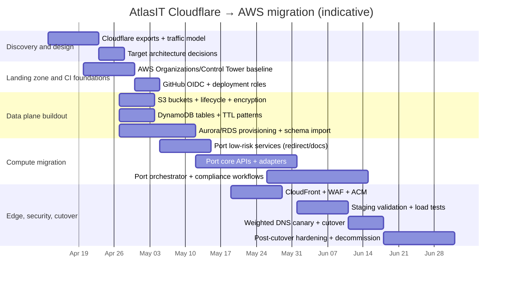

# AtlasIT migration from Cloudflare to AWS migration roadmap

## Executive summary

AtlasIT is presently deployed “on Cloudflare” with a multi-service architecture spanning a console web app, multiple HTTP APIs, workflow/orchestration components, and numerous adapter workers. The repository explicitly documents a **Cloudflare Pages / Workers-first deployment model**: a SvelteKit console app, multiple Workers (many using Hono), and heavy reliance on **Cloudflare D1 (SQLite semantics), KV, R2, Queues, Durable Objects, Workflows, and cron triggers**. fileciteturn11file0L1-L1 fileciteturn12file0L1-L1 fileciteturn18file0L1-L1

A successful migration to AWS therefore is not just “CDN/DNS swap”—it is a **platform re-host** that must replace Cloudflare-native primitives with AWS equivalents while preserving: (a) externally visible endpoints (domains + routes), (b) multi-tenant correctness, (c) workflow semantics (queues/cron/state), (d) auditability and compliance posture, and (e) current CI/CD automation.

A recommended end-state on AWS for AtlasIT’s current shape is:

- **Edge + security front door:** Amazon CloudFront with AWS WAF (and optionally AWS Shield Advanced; Shield Standard is included) protecting CloudFront and/or API Gateway. citeturn7search0turn4search1  
- **DNS + traffic shifting:** Amazon Route 53 with weighted records for canary / progressive cutover and fast rollback. citeturn3search1turn3search7turn3search9  
- **Compute:** primarily AWS Lambda behind API Gateway (HTTP API where possible), with CloudFront Functions / Lambda@Edge used only where “edge” is strictly required (redirects, header normalization, lightweight auth gating). CloudFront Functions cannot read request bodies, so they are unsuitable for most API logic. citeturn0search2turn0search9turn0search4  
- **Data:** replace D1 with a managed relational store (typically Aurora PostgreSQL / RDS PostgreSQL) or a split model (Aurora for transactional + DynamoDB for KV/session/idempotency). Cloudflare D1 is explicitly SQLite semantics and built into Workers/Pages, so this is a schema + query + operational migration, not a “lift and shift.” citeturn1search1  
- **Object storage:** replace R2 with S3; R2 exposes partial S3 API compatibility which can simplify data move tooling. citeturn1search4turn6search0  
- **Queues + background processing:** replace Cloudflare Queues with SQS + Lambda consumers, and replace cron triggers with EventBridge Scheduler / EventBridge rules. citeturn0search5turn8search1  
- **Observability:** CloudWatch (metrics + logs), OpenTelemetry (recommended direction as AWS X-Ray SDKs are moving into maintenance mode), and optional third-party sinks already present in repo variables (Sentry/Datadog). citeturn6search1turn4search3turn4search6fileciteturn14file0L1-L1

Because the repo does not include Cloudflare dashboard configuration for **DNS record inventory, WAF rules, rate limiting rules, page rules/redirect rules, load balancing, or Cloudflare analytics configuration**, those must be treated as **unspecified** and explicitly inventoried from Cloudflare APIs/exports before implementation. (The repo does include Cloudflare *routes* inside `wrangler.toml` files, which provides much of the public routing surface.) fileciteturn16file0L1-L1 fileciteturn17file0L1-L1 fileciteturn18file0L1-L1

## Current state baseline and Cloudflare dependency inventory

### Service topology from the repository

The repo’s top-level README describes AtlasIT as a multi-tenant IT automation/compliance platform deployed on Cloudflare with a defined set of Cloudflare-hosted components (console, core API, orchestrator, compliance worker, dispatch worker, onboarding, docs, email, redirects, marketplace, Slack workers). fileciteturn11file0L1-L1

Key routing and endpoints present in repo configuration include:

- `api.atlasit.pro` routes handled by `core-api` Worker (Hono) for `/api/*` + `/health`. fileciteturn16file0L1-L1  
- `www.atlasit.pro` is handled by a `console-app` worker configuration with an extensive list of routed paths, including many `/api/*` endpoints served from the console surface. fileciteturn17file0L1-L1  
- `orchestrator.atlasit.pro` routes handled by `ai-orchestrator` Worker, with cron triggers and queue consumer configuration. fileciteturn18file0L1-L1  
- `compliance.atlasit.pro` and `www.atlasit.pro/api/compliance/*` routes handled by `compliance-worker`. fileciteturn20file0L1-L1  
- `docs.atlasit.pro` routes handled by `documentation-worker`. fileciteturn21file0L1-L1  
- `atlasit.pro/*` and `status.atlasit.pro/*` handled by an apex redirect worker. fileciteturn22file0L1-L1  

This is a broad external surface area; it strongly suggests the AWS target design should maintain **domain- and path-level routing parity** during migration to avoid breaking clients, webhooks, and integrations.

### Cloudflare platform primitives in use

The repo directly configures and references (at minimum):

- **Workers / Pages runtime:** Many services are Workers; the console mentions “CF Pages (SvelteKit)” and Worker-based deployment artifacts. fileciteturn11file0L1-L1 fileciteturn17file0L1-L1  
- **D1 databases:** multiple D1 bindings are present across root `wrangler.toml`, `core-api`, `onboarding`, `marketplace`, `compliance-worker`, and a shared DB config. fileciteturn12file0L1-L1 fileciteturn15file0L1-L1 fileciteturn16file0L1-L1 fileciteturn29file0L1-L1  
- **KV namespaces:** sessions, cache, feature flags, idempotency caches, tasks, usage counters, state, docs KV, etc. fileciteturn12file0L1-L1 fileciteturn18file0L1-L1 fileciteturn21file0L1-L1  
- **R2 buckets:** evidence/policies/artifacts buckets; orchestrator uses an evidence bucket. fileciteturn12file0L1-L1 fileciteturn18file0L1-L1  
- **Queues:** the orchestrator defines producers/consumers for `atlasit-step-tasks` with retry and batch settings. fileciteturn18file0L1-L1  
- **Durable Objects + Cloudflare Workflows:** `ai-orchestrator` binds Durable Objects and a Cloudflare Workflows binding (`[[workflows]] ... class_name = "AtlasWorkflow"`). fileciteturn18file0L1-L1  
- **Cron triggers:** orchestrator uses multiple cron schedules; compliance worker has a `*/5` schedule. fileciteturn18file0L1-L1 fileciteturn20file0L1-L1  

Relevant product semantics (useful when mapping to AWS) include:

- Workers KV is **eventually consistent** and has explicit platform limits. citeturn2search2turn2search3  
- Cloudflare D1 is a serverless SQL database with SQLite semantics and supports “Time Travel” PITR-like restore for the last 30 days. citeturn1search1turn1search0  
- Cloudflare Queues provides async messaging between Workers (and beyond). citeturn0search5  
- Cloudflare R2 is S3 API compatible with documented differences and region handling (`auto` / `us-east-1` alias behaviors). citeturn1search4turn1search6  
- Durable Objects are stateful serverless compute units, and Cloudflare documents that SQLite-backed Durable Objects are generally available with specific limits. citeturn1search7turn1search2  

### CI/CD and deployment mechanics

The repository uses GitHub Actions to deploy Cloudflare components on push to `main`, applying D1 migrations and deploying only changed workers via `wrangler deploy`. fileciteturn13file0L1-L1

Operationally relevant details from CI/CD include:

- Cloudflare auth is stored as GitHub secrets (`CLOUDFLARE_ACCOUNT_ID`, `CLOUDFLARE_API_TOKEN`). fileciteturn13file0L1-L1  
- Smoke tests validate deployed endpoints by hitting health checks and basic probes. fileciteturn24file0L1-L1  
- The monorepo uses Node 20+, pnpm workspaces, Wrangler, and Cloudflare Workers types; it already contains a “build lambdas” script that bundles functions under `lambdas/` for Node 20 output, implying AWS Lambda adjacency or planned migration work. fileciteturn11file0L1-L1 fileciteturn25file0L1-L1 fileciteturn26file0L1-L1  

### Unspecified Cloudflare features to inventory externally

The following Cloudflare feature areas are **not represented** in the repository (therefore are “unspecified” until exported from Cloudflare):

- DNS record inventory (beyond route patterns).  
- CDN cache rules / page rules / redirect rules not expressed in Workers code.  
- WAF managed rules, custom firewall rules, bot management rules.  
- Cloudflare rate limiting rules (product-level), aside from application-level env vars in `.env.example`. fileciteturn14file0L1-L1  
- Cloudflare load balancing configuration (pools/monitors).  
- Cloudflare analytics settings and exported logs.

These must be pulled from Cloudflare’s DNS export and (if used) WAF / load balancing APIs. Cloudflare supports export of DNS records as a BIND zone file via dashboard or API. citeturn14search0turn14search3

## Target AWS architecture and Cloudflare-to-AWS mapping

### Recommended AWS target model for AtlasIT

A conservative, migration-friendly AWS target is **CloudFront + API Gateway + Lambda + S3 + DynamoDB + SQS + Aurora**, organized in a multi-account AWS Organization with staging and prod isolation. This is aligned with AWS guidance recommending account separation for workloads/environments and use of AWS Organizations / Control Tower for landing zones and guardrails. citeturn10search0turn10search2turn10search6turn10search1

From the repo, AtlasIT already splits into many independent Workers; Lambda functions map naturally to this “many small handlers” shape and enables parallel migration (one service at a time) while maintaining domain routing compatibility. fileciteturn11file0L1-L1 fileciteturn18file0L1-L1

A practical “front door” design for AtlasIT’s many subdomains is:

- **CloudFront distribution** with alternate domain names including `atlasit.pro` and wildcard `*.atlasit.pro` to absorb the many adapter subdomains and service subdomains. CloudFront explicitly supports wildcard alternate domain names (`*.example.com`) with documented constraints and requires the TLS certificate SAN to cover the wildcard. citeturn13search0turn13search1  
- **ACM certificate (us-east-1)** for CloudFront: AWS requires the ACM certificate used by CloudFront to be in `us-east-1`. citeturn3search4  
- **Lambda@Edge** (or CloudFront Functions) for host-based routing if a single distribution is used for multiple functional origins, because standard cache behaviors are path-based whereas AtlasIT uses multiple hosts (api/orchestrator/compliance/docs/adapter-*). Lambda@Edge is triggered on specific CloudFront event types and supports origin selection patterns; CloudFront documents the Lambda@Edge event structure and event types. citeturn0search4turn0search7  
- **Route 53 alias records** for apex and subdomains; CloudFront notes you can’t use a CNAME at the zone apex in standard DNS, which is why Route 53 aliases are commonly used for apex → CloudFront. citeturn13search1  

### High-level target architecture diagram

```mermaid
flowchart TB
  user[Users / Integrations] --> cf[Route 53]
  cf --> cfront[CloudFront + WAF]
  cfront -->|static| s3[S3 (console/docs/assets) via OAC]
  cfront -->|api routes| apigw[API Gateway (HTTP API)]
  apigw --> lambda[Lambda services\n(core-api, orchestrator, compliance, adapters, docs, email, slack, dispatch)]
  lambda --> aurora[(Aurora/RDS PostgreSQL)]
  lambda --> ddb[(DynamoDB\nsessions/cache/flags/idempotency)]
  lambda --> sqs[SQS (+ DLQ)]
  lambda --> s3obj[S3 (evidence/policies/artifacts)]
  eb[EventBridge Scheduler] --> lambda
  cw[CloudWatch + OTel] <---> lambda
```

CloudFront secure S3 origin access is typically done with Origin Access Control (OAC), which AWS recommends over the older Origin Access Identity for broader feature support (for example SSE-KMS and dynamic requests). citeturn15search6turn15search5

### Cloudflare features to AWS services mapping table

| Cloudflare capability | Observed in AtlasIT repo | AWS mapping | Notes / migration implications |
|---|---|---|---|
| DNS | **Unspecified** (DNS records not stored in repo; domains appear in `routes`) fileciteturn16file0L1-L1 | Route 53 public hosted zones | Export from Cloudflare using zone file export; import as Route 53 records; use weighted routing for canary cutover. citeturn14search0turn3search1 |
| CDN | Implicit via Cloudflare edge; specific cache rules **unspecified** | CloudFront | Implement cache policies and origin request policies per path; split static vs API behaviors. citeturn15search0turn15search1 |
| WAF | **Unspecified** (no WAF rules in repo) | AWS WAF (CloudFront scope) | Web ACL protects CloudFront; can add managed rules + rate-based rules. citeturn0search0turn4search0 |
| Workers / edge functions | Extensive: core APIs, orchestrator, compliance, docs, email, adapters, etc. fileciteturn11file0L1-L1 | Lambda + API Gateway; CloudFront Functions / Lambda@Edge for true edge needs | CloudFront Functions can’t access request body; use Lambda@Edge (or origin) for complex logic. citeturn0search2turn0search4turn0search9 |
| SSL/TLS | Implicit via Cloudflare-managed TLS; details **unspecified** | ACM + CloudFront / API Gateway custom domains | For CloudFront, certificate must be in `us-east-1`. citeturn3search4 |
| Rate limiting | App-level env defaults present; Cloudflare product rules **unspecified** fileciteturn14file0L1-L1 | AWS WAF rate-based rules; API Gateway throttling | AWS WAF rate-based rule semantics are approximate (not precise), suitable for abuse/DDoS mitigation. citeturn4search0turn4search7 |
| Page rules / redirects | Some redirects appear as a dedicated apex redirect worker. fileciteturn22file0L1-L1 | CloudFront Functions (redirects) or ALB listener rules | Redirect logic is lightweight; CloudFront Functions restrictions must be respected. citeturn0search2turn0search9 |
| Load balancing | **Unspecified** | Route 53 health checks + failover/latency routing; Global Accelerator | Global Accelerator provides static anycast IPs, health-based routing, multi-region failover patterns. citeturn3search0turn3search3turn3search6 |
| Analytics | Cloudflare analytics **unspecified**; repo references Sentry/Datadog keys fileciteturn14file0L1-L1 | CloudWatch (logs/metrics), CloudFront logs, WAF logs; third-party | CloudWatch has explicit pricing and log-delivery interactions (e.g., WAF/CloudFront log delivery allowances). citeturn6search1turn7search0 |
| D1 (serverless SQL) | Multiple D1 databases: shared, core, audit, compliance, etc. fileciteturn12file0L1-L1 fileciteturn15file0L1-L1 | Aurora/RDS PostgreSQL (recommended) or Aurora MySQL | D1 is SQLite-semantics; migration requires schema/tooling strategy and cutover plan; D1 has features like Time Travel backups. citeturn1search1turn1search0 |
| KV namespaces | Sessions/cache/flags/tasks/idempotency/etc. fileciteturn12file0L1-L1 fileciteturn18file0L1-L1 | DynamoDB (plus TTL) or ElastiCache; CloudFront KeyValueStore for edge-only keys | Cloudflare KV is eventually consistent; DynamoDB consistency choices differ; TTL is native in DynamoDB and supports session-like patterns. citeturn2search2turn8search5 |
| R2 buckets | Evidence/policies/artifacts and orchestrator evidence storage. fileciteturn12file0L1-L1 fileciteturn18file0L1-L1 | S3 (optionally with lifecycle tiers) | R2’s S3 API compatibility can ease migration tooling; S3 cost drivers include storage and requests. citeturn1search4turn6search0 |
| Queues | Orchestrator produces/consumes `atlasit-step-tasks`. fileciteturn18file0L1-L1 | SQS + Lambda event source mapping (+ DLQ) | Cloudflare Queues semantics map well to SQS; cost is per request, payload chunking matters. citeturn0search5turn8search1 |
| Durable Objects / Workflows | Durable Objects + Cloudflare Workflows in orchestrator. fileciteturn18file0L1-L1 | Step Functions + DynamoDB (state), or EventBridge + DynamoDB | Durable Objects are stateful compute; AWS equivalent is composite (workflow engine + state store). citeturn1search7 |

## Migration roadmap and deliverables

### Migration strategy and constraints

A phased strategy is essential because AtlasIT’s state is spread across D1/KV/R2/Queues/DOs; moving compute without a plan for data and state transitions will break correctness. fileciteturn12file0L1-L1 fileciteturn18file0L1-L1

The most migration-resilient approach is a **parallel-run + progressive cutover**:

- Build AWS infrastructure and services in parallel (dev → staging → prod).  
- Implement dual-write or replication bridges where needed (especially for DB and object storage).  
- Shift traffic gradually using Route 53 weighted routing (and/or CloudFront origin routing) so rollback is “change weights back,” not “rebuild production.” Route 53 weighted routing is explicitly designed for sending proportions of traffic between multiple resources. citeturn3search1  

### Phased roadmap with actionable tasks and deliverables

The phases below assume a start around **April 13, 2026** (next business week after the provided date) and are intended to be “Claude-executable” as a backlog of tasks and concrete artifacts.

#### Discovery and inventory

Primary goal: transform “unspecified” Cloudflare configuration into explicit migration inputs, and define the AWS target boundaries.

Deliverables:

- **Cloudflare zone export (BIND)** via Cloudflare DNS export API or dashboard export. citeturn14search0turn14search3  
- **Cloudflare feature usage report** (WAF rules, rate limiting rules, redirect/page rules, load balancing pools/monitors, analytics/logpush) marked as “present/absent” plus export artifacts if present. (Repo does not supply these.)  
- **Endpoint surface map** derived from `wrangler.toml` routes and README service list (domains + path patterns). fileciteturn11file0L1-L1 fileciteturn16file0L1-L1 fileciteturn17file0L1-L1  
- **Data inventory**: enumerate all D1 databases and KV namespaces referenced in Wrangler configs plus estimated sizes/ops. fileciteturn12file0L1-L1 fileciteturn20file0L1-L1  
- **Traffic model input sheet** (requests/month, bandwidth out, API burst rates, queue depth, cron frequency), because cost sizing and rate limiting thresholds require it. (Not in repo.)  
- **Decision record**: choose (a) compute model (Lambda+API GW vs ECS), (b) DB strategy (Aurora vs other), (c) multi-region stance (single-region + DR vs active-active).

#### AWS landing zone and account structure

Primary goal: create a governed multi-account environment with operational guardrails.

Deliverables:

- **AWS Organization + Control Tower landing zone** with management, log archive, and audit accounts (as per AWS prescriptive guidance for Control Tower landing zones). citeturn10search2turn10search6  
- **Organizational Units (OUs)** that separate production workloads from non-production and foundational accounts, per AWS Organizations best practices. citeturn10search0turn10search7  
- **Central logging and security baselines**: CloudTrail and centralized log storage (implementation detail depends on chosen guardrails/tooling; Control Tower typically orchestrates baseline governance). citeturn10search2  
- **CI/CD auth model**: GitHub Actions → AWS via OIDC, avoiding long-lived AWS keys; GitHub documents `id-token: write` and OIDC flow for AWS. citeturn12search0turn12search3  

#### Data plane migration

Primary goal: establish AWS-equivalent data stores and migrate/replicate Cloudflare state.

Deliverables:

- **Aurora/RDS schema and migration plan** for D1 databases:
  - `atlasit-shared` (used by core-api and orchestrator; also referenced by console bindings). fileciteturn15file0L1-L1 fileciteturn16file0L1-L1 fileciteturn18file0L1-L1  
  - `atlas_core_db` (used by onboarding and marketplace). fileciteturn29file0L1-L1 fileciteturn31file0L1-L1  
  - `atlasit_compliance` (compliance worker). fileciteturn20file0L1-L1  
- **Object storage migration**: R2 buckets → S3 buckets with lifecycle policies; R2’s S3-compatible API can be used by standard tooling, but confirm unsupported operations and differences. citeturn1search4turn6search0  
- **KV migration**: Workers KV namespaces → DynamoDB tables (or a small set of tables with partitioning):
  - Session store (`KV_SESSIONS`), cache (`KV_CACHE`), feature flags (`KV_FEATURE_FLAGS`), idempotency cache, tasks counters, etc. fileciteturn12file0L1-L1 fileciteturn18file0L1-L1  
  - Note Cloudflare KV’s eventual consistency; design AWS consistency explicitly (eventually consistent reads vs strongly consistent reads) and use TTL for ephemeral keys. citeturn2search2turn8search5  
- **Queues migration**: Cloudflare Queues → SQS (standard) + DLQ, plus Lambda consumer mapping and retry policy. citeturn0search5turn8search1  

#### Compute and workflow migration

Primary goal: port each Worker/Pages function into AWS compute and replicate orchestration semantics.

Deliverables:

- **Service-by-service port plan**, prioritizing least-stateful first:
  - Apex redirects (`atlasit.pro`, `status.atlasit.pro`) as CloudFront Function / Lambda@Edge. fileciteturn22file0L1-L1 citeturn0search2  
  - Docs service: either static to S3 or keep dynamic via Lambda. fileciteturn21file0L1-L1  
  - Email worker: move to SES or keep current provider; ensure secrets/usage tracking equivalent. fileciteturn23file0L1-L1  
  - Core APIs: `core-api`, `dispatch-worker`, `marketplace`, `onboarding`. fileciteturn16file0L1-L1 fileciteturn19file0L1-L1 fileciteturn31file0L1-L1  
  - Orchestrator + compliance: migrate cron triggers and queues; replace Durable Objects/Workflows with Step Functions + DynamoDB state patterns. fileciteturn18file0L1-L1 fileciteturn20file0L1-L1  
- **Orchestration replacement design**:
  - Cloudflare cron triggers → EventBridge schedules.
  - Cloudflare Workflows → Step Functions state machines.
  - Durable Objects state → DynamoDB (conditional writes for concurrency control) and Step Functions execution context.

- **Service discovery / internal auth replacement**:
  - Cloudflare supports “service bindings” between workers (console config binds compliance/marketplace/email services). This becomes internal service-to-service calls among AWS components (API Gateway private integrations, VPC routing, or direct Lambda invocation), and must be protected with IAM (SigV4), mTLS, or a shared auth strategy. fileciteturn17file0L1-L1  
  - The repo already uses shared secrets/HMAC patterns for agents (Slack agent mentions an HMAC secret). Carry this forward into Secrets Manager / Parameter Store with rotation plan. fileciteturn32file0L1-L1 citeturn9search0  

#### Edge, DNS, and cutover

Primary goal: put AWS in the request path safely and progressively.

Deliverables:

- **ACM certificates** (apex + wildcard) issued/validated, and CloudFront distribution configured with them; CloudFront requires ACM certs in `us-east-1`. citeturn3search4turn13search1  
- **CloudFront distribution(s)**:
  - Alternate domain names include `atlasit.pro` and `*.atlasit.pro`; CloudFront explicitly supports beginning-of-name wildcards like `*.example.com`. citeturn13search0  
  - Cache policy and origin request policy design for static vs dynamic endpoints. citeturn15search0turn15search1turn15search8  
- **AWS WAF WebACL** attached to CloudFront distribution and (optionally) API Gateway; WAF WebACLs can protect CloudFront distributions and API Gateway resources. citeturn0search0turn0search3  
- **Route 53 hosted zone + records** including weighted records for canary cutover. Weighted routing is well-supported for shifting traffic by relative weight; TTL must be consistent across weighted record sets and 60 seconds is recommended under specific alias/non-alias mixes. citeturn3search1turn3search7  
- **Rollback runbook** (detailed below) and operational readiness sign-off.

### Indicative timeline as mermaid Gantt



## Infrastructure as Code scaffolding and CI/CD modernization

### IaC options and recommendation

All three AWS-native IaC approaches are viable:

- Terraform: best if you already standardize on it and want provider-agnostic modules and policy-as-code pipelines.  
- CloudFormation: first-party integration and Control Tower customizations (CfCT) often use CloudFormation templates. citeturn10search5turn15search9  
- AWS CDK: strong developer ergonomics, but adds runtime/toolchain complexity.

Given current repository practices (GitHub Actions automation, explicit “no secrets in config” guidance, and production-grade deployment pipeline), Terraform is typically the most frictionless for repeatable, auditable, multi-account delivery.

### Sample Terraform snippets

The snippets below are intentionally “scaffolding,” designed to be expanded into modules (network, edge, identity, data, compute). They show core patterns required to replace Cloudflare DNS/CDN/TLS/WAF + static hosting.

#### ACM wildcard certificate for CloudFront in us-east-1

```hcl
# providers.tf
provider "aws" {
  region = var.primary_region
}

provider "aws" {
  alias  = "use1"
  region = "us-east-1"
}

# acm.tf (us-east-1 for CloudFront)
resource "aws_acm_certificate" "atlasit" {
  provider          = aws.use1
  domain_name       = "atlasit.pro"
  validation_method = "DNS"

  subject_alternative_names = [
    "*.atlasit.pro",
  ]
}

# Route53 validation records omitted for brevity:
# aws_route53_record for each domain_validation_option + aws_acm_certificate_validation
```

This reflects AWS’s requirement that CloudFront viewer certificates in ACM must be in `us-east-1`. citeturn3search4

#### S3 + CloudFront OAC for the console/docs static origin

```hcl
resource "aws_s3_bucket" "console" {
  bucket = "atlasit-console-${var.env}"
}

resource "aws_cloudfront_origin_access_control" "console_oac" {
  name                              = "atlasit-console-oac-${var.env}"
  description                       = "OAC for console S3 origin"
  origin_access_control_origin_type = "s3"
  signing_behavior                  = "always"
  signing_protocol                  = "sigv4"
}

resource "aws_cloudfront_distribution" "atlasit" {
  enabled = true

  aliases = [
    "atlasit.pro",
    "*.atlasit.pro",
  ]

  origin {
    domain_name              = aws_s3_bucket.console.bucket_regional_domain_name
    origin_id                = "s3-console"
    origin_access_control_id = aws_cloudfront_origin_access_control.console_oac.id
  }

  default_cache_behavior {
    target_origin_id       = "s3-console"
    viewer_protocol_policy = "redirect-to-https"
    allowed_methods        = ["GET", "HEAD", "OPTIONS"]
    cached_methods         = ["GET", "HEAD", "OPTIONS"]

    # Attach managed cache policy IDs or custom ones (not shown)
  }

  viewer_certificate {
    acm_certificate_arn      = aws_acm_certificate_validation.atlasit.certificate_arn
    ssl_support_method       = "sni-only"
    minimum_protocol_version = "TLSv1.2_2021"
  }
}
```

OAC is recommended for restricting access to S3 origins and improving security posture relative to OAI. citeturn15search6turn15search5

#### WAF Web ACL sketch for CloudFront + rate limiting

```hcl
resource "aws_wafv2_web_acl" "atlasit_edge" {
  name  = "atlasit-edge-${var.env}"
  scope = "CLOUDFRONT"

  default_action { allow {} }

  rule {
    name     = "aws-managed-common"
    priority = 1

    override_action { none {} }

    statement {
      managed_rule_group_statement {
        name        = "AWSManagedRulesCommonRuleSet"
        vendor_name = "AWS"
      }
    }

    visibility_config {
      cloudwatch_metrics_enabled = true
      metric_name                = "awsManagedCommon"
      sampled_requests_enabled   = true
    }
  }

  rule {
    name     = "rate-limit-global"
    priority = 10

    action { block {} }

    statement {
      rate_based_statement {
        limit              = 2000
        aggregate_key_type = "IP"
      }
    }

    visibility_config {
      cloudwatch_metrics_enabled = true
      metric_name                = "rateLimitGlobal"
      sampled_requests_enabled   = true
    }
  }

  visibility_config {
    cloudwatch_metrics_enabled = true
    metric_name                = "atlasitEdgeWebACL"
    sampled_requests_enabled   = true
  }
}
```

AWS WAF WebACLs protect CloudFront distributions and support rate-based rule statements for automated request flood mitigation. citeturn0search0turn4search0

### CI/CD modernization: GitHub Actions with AWS OIDC

Replace Cloudflare secrets-based deployment with GitHub’s OIDC federation into AWS (short-lived credentials), which GitHub explicitly recommends to avoid long-lived credentials and requires `id-token: write` in workflow permissions. citeturn12search0turn11search4

A minimal workflow scaffold (illustrative) for Terraform apply:

```yaml
name: aws-infra-apply
on:
  push:
    branches: [ "main" ]

permissions:
  id-token: write
  contents: read

jobs:
  terraform:
    runs-on: ubuntu-latest
    steps:
      - uses: actions/checkout@v5
      - uses: aws-actions/configure-aws-credentials@v4
        with:
          role-to-assume: arn:aws:iam::<ACCOUNT_ID>:role/github-oidc-atlasit-deployer
          aws-region: us-east-1
      - uses: hashicorp/setup-terraform@v3
      - run: terraform init
      - run: terraform plan -out tfplan
      - run: terraform apply -auto-approve tfplan
```

(Use environment protection rules + manual approvals for prod applies; keep the pipeline non-interactive for automation, but gated.)

## Testing, validation, cutover, and rollback playbooks

### Testing and validation plan aligned to current repo practices

AtlasIT already runs TypeScript strict checks, Vitest suites, Playwright smoke tests, and a smoke-test script targeting health endpoints. fileciteturn11file0L1-L1 fileciteturn24file0L1-L1

A migration-safe validation strategy should preserve and extend these layers:

- **Build-time validation:** typecheck + lint + unit tests across all packages. fileciteturn25file0L1-L1  
- **Contract tests for each public endpoint:** replay a set of golden requests against Cloudflare prod and AWS staging/prod to confirm response code, schema, headers, latency bounds, and auth behavior.  
- **E2E smoke tests:** keep the existing health endpoints semantics as the “readiness gate” for weighted cutover; the current smoke test expects specific health paths and fields per service name. fileciteturn24file0L1-L1  
- **Performance tests:** verify CloudFront cache behaviors (hit ratio) and API latency under load; ensure WAF doesn’t degrade legitimate traffic. CloudFront cache policy controls cache key construction and affects hit ratio. citeturn15search0turn15search8  
- **Security tests:** WAF managed rules coverage, rate-based rules, OWASP ASVS baseline for the console, and IAM policy validation/least privilege.

### Validation checklist

| Area | Checks | Acceptance criteria |
|---|---|---|
| DNS readiness | Route 53 records created; TTL lowered ahead of cutover | TTL set per Route 53 best practices (60–172,800 seconds) with cutover records near the low end; ensure weighted record sets use consistent TTL. citeturn3search9turn3search7 |
| TLS | ACM cert validated; CloudFront uses cert in us-east-1 | HTTPS works for apex + wildcard subdomains; CloudFront certificate requirement satisfied. citeturn3search4turn13search0 |
| Edge restrictions | Any CloudFront Function usage avoids request body dependence | CloudFront Functions cannot access request body; use Lambda@Edge/origin for body-dependent logic. citeturn0search2turn0search9 |
| WAF | WebACL associated; managed rules enabled; rate-limiting configured | Requests are inspected; rate-based rules behave as expected (with caveats about precision). citeturn0search0turn4search7 |
| Data migration | D1 data migrated; KV state migrated; R2 objects migrated | Data parity verified via row counts/checksums; object counts and key prefixes validated; no missing critical state. fileciteturn12file0L1-L1 |
| Workflow execution | Queue consumer semantics preserved; cron schedules preserved | SQS DLQ + retries match expected semantics; EventBridge schedules align with current crons (e.g., */5). fileciteturn18file0L1-L1 fileciteturn20file0L1-L1 |
| Observability | Logs + metrics present; tracing works | CloudWatch logs/metrics present; tracing via OTel where applicable; alerts configured on SLOs. citeturn6search1turn4search3turn4search6 |

### DNS cutover procedure with TTL recommendations

1. **Pre-cutover TTL reduction (48–72 hours before):** Reduce TTL on critical records (apex + key subdomains) to allow faster propagation and rollback. Route 53 recommends a TTL range of 60–172,800 seconds depending on responsiveness vs query volume tradeoffs. citeturn3search9  
2. **Deploy AWS endpoints in parallel:** Ensure CloudFront distributions and API custom domains are healthy; validate certificates. CloudFront CNAME/alternate domain requirements must be met (valid TLS certificate covering all aliases). citeturn13search1turn3search4  
3. **Canary cutover using weighted routing:** Create weighted record sets routing a small percentage (for example, 1/256) to AWS while most remains on Cloudflare. Weighted routing explicitly supports this pattern. citeturn3search1  
4. **Progressive increase:** Shift weights progressively (1% → 5% → 25% → 50% → 100%) while monitoring error rates, p95 latency, and key workflows.  
5. **Stabilize and restore TTL:** After full cutover and a stable window, increase TTL to a more cost-efficient value (but only after rollback risk is low; keep “fast rollback” TTL longer if desired).

If using weighted alias and non-alias mixes, Route 53 warns that TTL consistency across record sets matters and provides a 60s TTL recommendation in a particular alias scenario to avoid unexpected weighting effects. citeturn3search7

### Rollback playbook

Rollback must be quick, deterministic, and require no rebuild. A viable rollback design uses DNS weights and preserves Cloudflare as the “hot standby” until decommission.

Rollback triggers (examples):

- sustained 5xx above error budget (e.g., >0.5% for 5 minutes)  
- p95 latency regression beyond SLO  
- auth/session failures detected in console or API  
- data integrity alarms (write failures, queue backlog explosion)

Rollback steps:

1. **Immediate traffic shift:** Set Route 53 weights back to Cloudflare (e.g., AWS weight → 0, Cloudflare → 255). Weighted routing supports this change by design. citeturn3search1  
2. **Contain blast radius:** If failures are isolated to a subdomain, rollback only that record set (keep other migrated services live).  
3. **Data consistency handling:**  
   - If dual-write was enabled, ensure Cloudflare remains compatible with the chosen data store or restore write target.  
   - If a “maintenance freeze” cutover was used, rollback should include reversing any DB writer endpoints or re-enabling Cloudflare writes.  
4. **Post-rollback forensics:** Use CloudWatch logs, WAF logs, and tracing to isolate failure points (plus any third-party tools you already use, such as Sentry). citeturn6search1turn7search0fileciteturn14file0L1-L1  

## Cost estimation methodology, rough ranges, and observability plan

### Cost estimation approach

Because traffic volumes and payload sizes are not present in the repo, cost must be produced as a **methodology + variable-driven model**, then instantiated once real metrics are collected.

Core AWS cost drivers for this migration:

- **Route 53:** hosted zones and DNS queries. Route 53 pricing provides per-hosted-zone monthly fees and per-million query fees. citeturn5search0  
- **CloudFront:** data transfer out + requests; optionally flat-rate plans exist that bundle CloudFront + WAF + Route53 + logs + compute for predictable monthly pricing. citeturn8search4turn8search6turn7search1  
- **AWS WAF:** WebACL count + rule count + request volume. citeturn7search0  
- **Lambda:** request count and duration (GB-seconds). Lambda pricing is explicitly request- and duration-based, with free tier and tiered options. citeturn5search1  
- **API Gateway:** per-request and data transfer out (plus caching if enabled). citeturn9search6turn9search1  
- **S3:** storage, requests, and data transfer (but transfer from S3 to CloudFront is not charged as S3 egress). citeturn6search0  
- **SQS:** per-request (payload chunking affects request counts). citeturn8search1  
- **DynamoDB:** per read/write request unit consumption (on-demand is pay-per-request). citeturn8search0turn8search5  
- **CloudWatch:** logs ingestion/storage, custom metrics, and related features. citeturn6search1  
- **Secrets Manager:** per-secret monthly charge and API call costs. citeturn9search0  

### Example “rough range” costing (illustrative, requires real metrics)

Because AtlasIT appears to be a SaaS control plane with moderate web/API traffic (not a video CDN), a typical early-stage cost envelope often falls into:

- **Low traffic / early launch:** hundreds of USD/month range  
- **Moderate SaaS traffic:** low thousands USD/month range  
- **High traffic + heavy WAF inspection + high data transfer:** potentially 5 figures USD/month (especially if bandwidth is large)

A more concrete example can be built as:

- DNS queries: `Q_dns_million * $0.40` (standard queries, first 1B) citeturn5search0  
- WAF requests: `Q_http_million * $0.60` + WebACL/rule fixed costs (example pricing shown by AWS) citeturn7search0  
- Lambda requests: `Q_lambda_million * $0.20` + duration GB-sec cost (per pricing page) citeturn5search1  
- SQS requests: `(Q_send + Q_receive + Q_delete)/1M * rate` (payload chunking may multiply) citeturn8search1  
- S3: `GB_month * rate + requests + transfer` (note CloudFront path reduces direct internet egress from S3). citeturn6search0  

If cost predictability is a priority (and you want closer alignment to Cloudflare’s “bundled edge platform” feel), evaluate CloudFront flat-rate plans that bundle CloudFront + WAF + Route53 + logs + edge compute for a fixed monthly price (tiers and pricing are documented by AWS). citeturn8search6turn7search1turn8search4

### Monitoring and observability plan

A migration changes failure modes; observability must be “front-loaded” so you can validate and cut over safely.

Recommended baseline:

- **CloudWatch Logs:** JSON structured logs for each Lambda, correlated with request IDs; CloudWatch pricing and included allowances around CloudFront/WAF logs are documented. citeturn6search1turn7search0  
- **Metrics:** “golden signals” (latency, traffic, errors, saturation) per endpoint, plus SQS queue depth and DLQ counts, DynamoDB throttles, RDS/Aurora CPU/connection saturation.  
- **Tracing:** Use OpenTelemetry distribution (ADOT) for Lambda and propagate trace context from CloudFront/API Gateway. AWS recommends ADOT as a supported path; X-Ray SDK for Node is in maintenance mode with recommendation to migrate to OpenTelemetry. citeturn4search3turn4search6  
- **Security telemetry:** WAF sampled requests and logs; rate-based rule triggers; Shield events if enabled. Shield offers Standard and Advanced tiers and integrates with WAF for advanced protections. citeturn4search1turn4search0  

### Team roles and responsibilities

Given AtlasIT security/compliance goals and multi-tenant nature, a minimal responsibility split that prevents “everyone is responsible → nobody is responsible”:

| Role | Responsibilities | Key deliverables |
|---|---|---|
| Platform / SRE lead | Landing zone, networking, CloudFront/WAF, release engineering, SLOs, rollback readiness | Terraform modules, CI pipelines, runbooks, alerting |
| Application lead | Port Workers → Lambda, refactor runtime adapters, maintain API compatibility | Service migration PRs, contract tests, performance fixes |
| Data lead | D1 → Aurora schema strategy, data migration tooling, data integrity validation | Migration scripts, reconciliation reports, cutover procedures |
| Security lead | IAM guardrails, secrets management, WAF rules, compliance evidence, threat modeling | IAM policies, WAF config, key rotation plans, audit artifacts |
| QA / test automation | E2E suites, canary validation, regression harness | Test plans, Playwright suites, canary dashboards |

AWS strongly emphasizes least privilege and temporary credentials (federation) for secure operations, which directly impacts CI/CD role design and review workflows. citeturn11search4turn12search0