# Autonomy Diagrams

## System Architecture

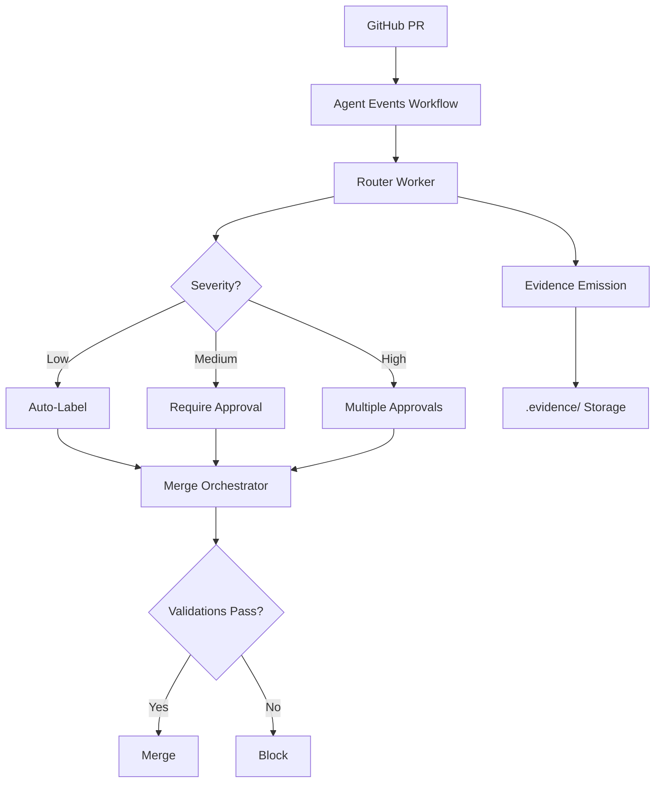

## PR Routing Flow

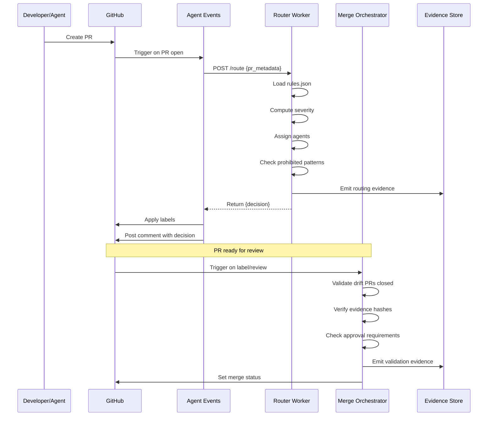

## Drift Detection Flow

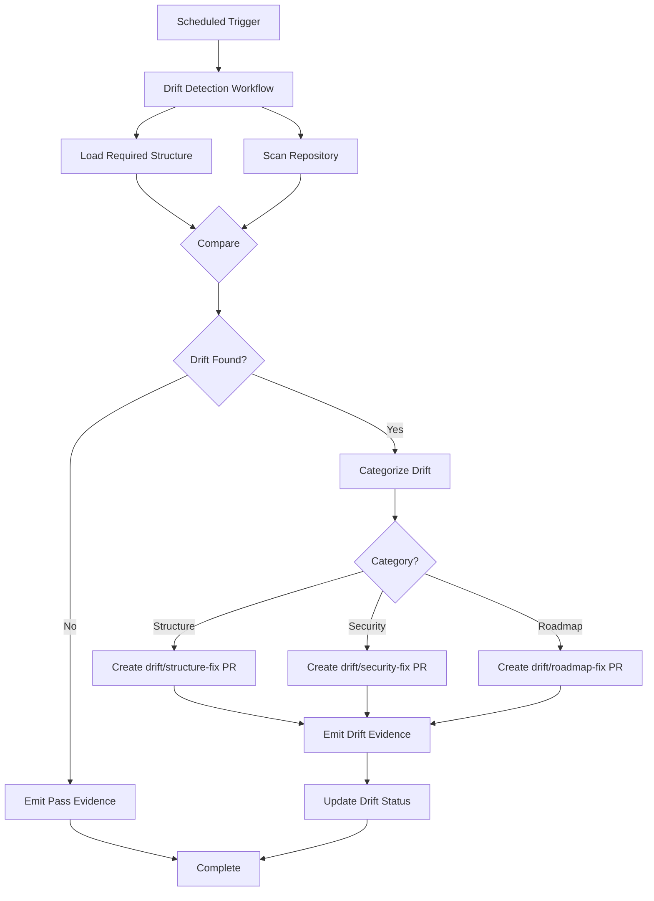

## Evidence Chain

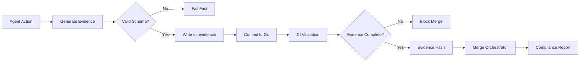

## Multi-Agent Coordination

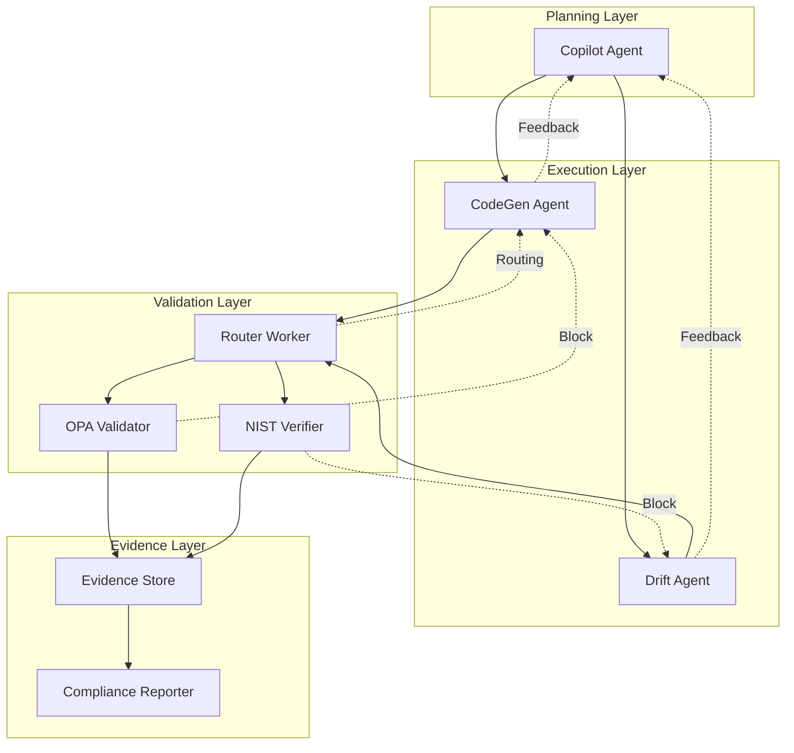

## Severity-Based Routing

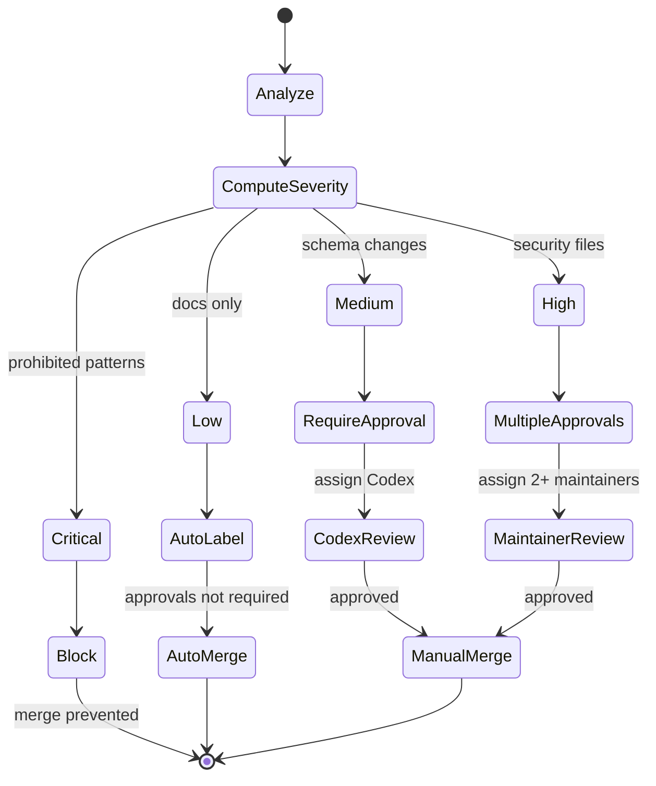

## Deployment Pipeline

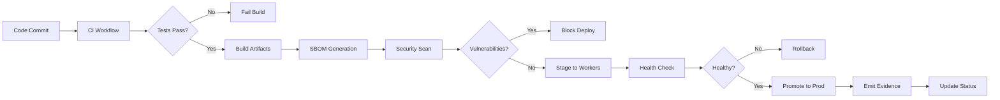

## Evidence Lifecycle

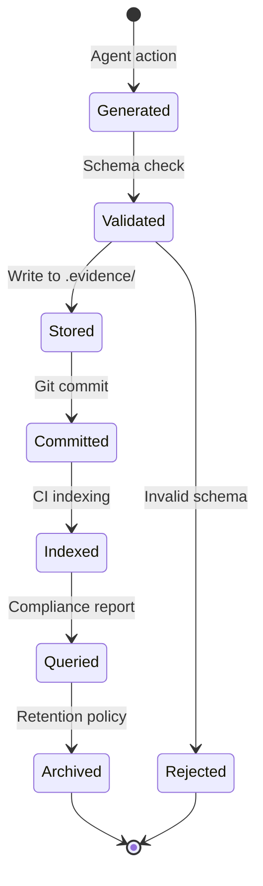

## Autonomous Decision Tree

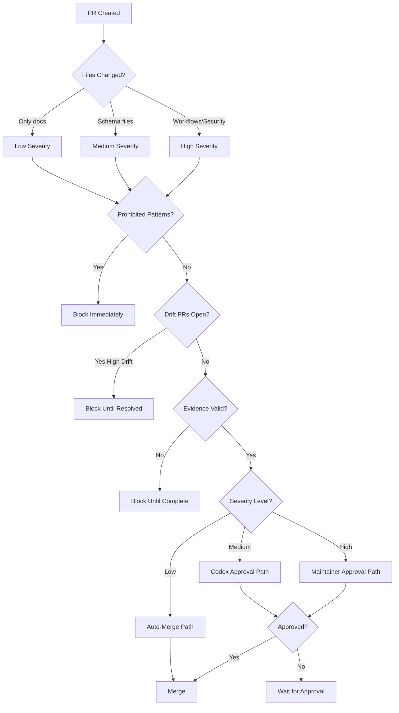

## Worker Architecture

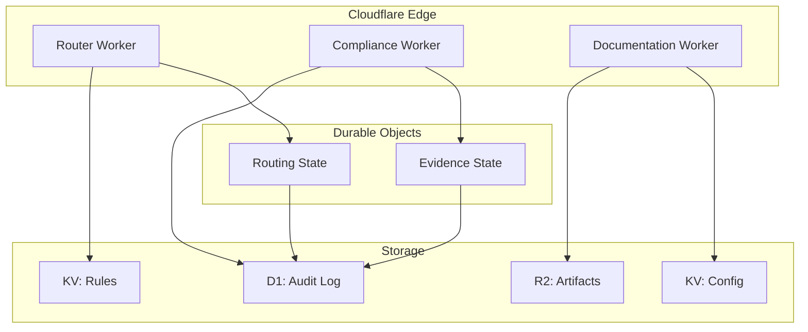

## Compliance Automation

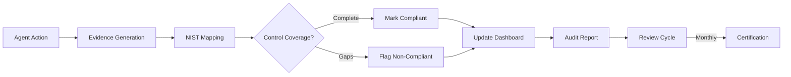

## Notes

- All diagrams represent the target architecture after Phase 1 completion
- Mermaid syntax used for version control and automated rendering
- Diagrams updated as implementation evolves
- Reference implementation details in respective spec files
