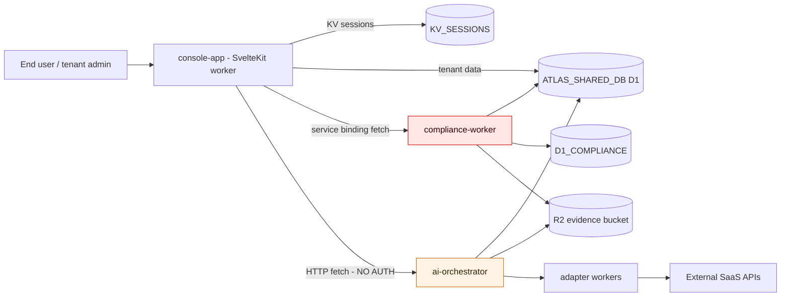

# AtlasIT Platform — Combined Quality & Security Audit

**Date:** April 7, 2026
**Platform:** https://www.atlasit.pro (Production)
**Repo:** JW-Flo/Project-AtlasIT (monorepo — Cloudflare Workers + SvelteKit console)
**Audit Sources:**
- Browser-based QA (Claude — automated Chrome testing as super-admin joe.whittle@atlasit.app)
- Deep code audit (GPT — static analysis of full monorepo)
- Source code trace (Claude — targeted investigation of JML automation pipeline)

---

## Executive Summary

This combined audit covers the AtlasIT platform from two angles: live browser testing of the production UI and static code analysis of the full monorepo. Together they reveal a platform that is roughly **55% functional at the UI layer** and carries **critical security vulnerabilities** in the backend that would predictably break real tenants in production.

**Three "stop-the-line" risk clusters** (from code audit):

1. **Publicly reachable compliance endpoints bypass authentication and tenant isolation** — enabling cross-tenant data exfiltration and evidence poisoning.
2. **MFA implementation leaks secrets** — TOTP secrets sent to a third-party QR service and stored as plaintext in D1.
3. **Inter-service auth is broken** — core features (evidence scoring, JML events, Copilot) silently fail because internal HTTP calls carry no auth headers and the role hierarchy doesn't support API-key access.

**Key UI-layer findings** (from browser QA):

- **9 of 25 pages crash** with "Something went wrong" on load (~36% of routes inaccessible)
- **Compliance Copilot AI** returns 403 on all endpoints — fully non-functional
- **Joiner workflow never fires** — 0 runs despite 12 new joiners with departments populated (code-confirmed root cause: missing auth on event POST + D1 race condition)
- **Multiple data inconsistencies** — compliance scores differ across Dashboard, Insights, and Analytics views

**Total findings: 39** (9 Critical, 12 High, 12 Medium, 6 Low/Enhancement)

---

## Trust Boundary Diagram

The compliance worker is publicly routable (`compliance.atlasit.pro/*`, `www.atlasit.pro/api/compliance/*`) with several handlers accepting `tenantId` from request params without auth. The orchestrator receives events from the console with no auth headers.

---

## Critical Findings (P0)

### C-1. Unauthenticated Cross-Tenant Compliance Endpoints
**Source:** Code audit
**Category:** Security — Tenant Isolation
**Location:** `compliance-worker/src/index.ts` (routes: `/api/evidence/*`, `/api/v1/evidence`, `/api/compliance/snapshot`)

Multiple endpoints bypass `requireTenant()` and accept `tenantId` from query/body/header:
- `GET/HEAD /api/compliance/snapshot` — uses `tenantId = url.searchParams.get("tenantId") || DEFAULT_TENANT` with no auth
- `POST /api/evidence/ingest` — accepts `body.tenantId`, writes to R2 + D1 indexes
- `GET /api/evidence/search` — filters by `tenantId` without auth
- `GET /api/v1/evidence` — accepts `tenant_id` param or `x-tenant-id` header without auth

**Impact:** Any unauthenticated actor can enumerate evidence metadata, ingest bogus evidence for another tenant (poisoning scoring and audit trails), and retrieve snapshots for arbitrary tenant IDs. This is an existential multi-tenant breach.

**Fix:** Make `requireTenant()` mandatory for all tenant-scoped routes. Enforce tenant ID exclusively from validated token context, never from request params. Update `validateEnv()` to require `API_TOKENS` and fail-closed. Add Cloudflare WAF/rate limiting at the edge as defense-in-depth.

---

### C-2. TOTP Secrets Leaked to Third-Party QR Service
**Source:** Code audit
**Category:** Security — MFA
**Location:** `console-app/src/routes/console/settings/security/+page.svelte`

TOTP enrollment embeds the full `otpauth://` URI (containing the TOTP secret) into a URL to `api.qrserver.com` to generate the QR image. The secret is transmitted to and potentially logged by a third party.

**Impact:** MFA secret confidentiality is broken. Users on managed networks with proxy logging are especially exposed. This directly undermines SOC2/ISO compliance claims around MFA.

**Fix:** Generate QR codes client-side using a pure JS QR library (e.g., `qrcode`). Never send secrets off-domain. Add a regression test asserting no external QR URLs appear in DOM.

---

### C-3. TOTP Secrets Stored as Plaintext in D1
**Source:** Code audit
**Category:** Security — MFA
**Location:** `console-app/src/routes/api/auth/mfa/setup/+server.ts`, `packages/shared/src/crypto/totp.ts`

The DB field is named `secret_encrypted`, but the code stores the raw base32 TOTP secret and verifies against it directly — no encryption.

**Impact:** A D1 read exposure (operator mistake, compromised token, misrouted query) yields MFA secrets directly, enabling account takeover even if passwords remain safe.

**Fix:** Encrypt TOTP secrets at rest using a tenant-scoped or platform key with KMS wrapping. Store only `{encrypted_secret, key_version}`. Add a canary test asserting DB never contains a raw base32 TOTP secret pattern.

---

### C-4. Nine Console Pages Crash on Load
**Source:** Browser QA
**Category:** Stability — Frontend
**Impact:** ~36% of sidebar routes are completely inaccessible

| Route | Breadcrumb |
|-------|-----------|
| `/console/attestations` | Attestations |
| `/console/packs` | Packs |
| `/console/rules` | Rules |
| `/console/runs` | Runs |
| `/console/nhi-governance` | Nhi Governance |
| `/console/jml-changelog` | Jml Changelog |
| `/console/access-requests` | Access Requests |
| `/console/evidence` | Evidence |
| `/console/status` | Status |

All show "Something went wrong — An unexpected error occurred" with Reload/Dashboard buttons. The error boundary works but provides no diagnostic info.

**Fix:** Add error logging to the error boundary to capture the actual exception. Check each route's data-fetching hooks for missing null guards on API responses.

---

### C-5. Compliance Copilot AI — Fully Non-Functional (403 on All Endpoints)
**Source:** Browser QA + Network inspection
**Category:** Feature — AI Assistant

All Copilot API calls return HTTP 403:
- `GET /api/copilot/actions` — 403 (4 calls observed)
- `POST /api/copilot/chat` — 403

Suggested action buttons produce no response. Free-text queries return "Sorry, I'm having trouble right now."

**Fix:** Check auth middleware for `/api/copilot/*` routes. Likely a missing permission grant, API key misconfiguration, or AI backend service unreachable.

---

### C-6. Joiner Workflow Never Fires — Department Auto-Group Broken
**Source:** Browser QA + Code trace (confirmed)
**Category:** Feature — JML Automation
**Location:** `console-app/src/routes/api/directory/sync/+server.ts` (lines 314-322), `ai-orchestrator/src/routes/events.ts` (line 32), `ai-orchestrator/src/lib/jml-engine.ts` (lines 188-211)

**Observed:** 12 new joiners (30d), departments populated (Engineering, Security, Sales, HR, Finance, DevOps), 5 department-matched lifecycle roles with app mappings — but **Joiner: 0 runs**, **0 users assigned** to any lifecycle role.

**Root cause (multi-layered):**

1. **No auth on event POST** — Directory sync sends `user.created` events to `/api/v1/events` with zero auth headers. The orchestrator requires `requireRole("member")` → 401/403.
2. **Errors silently swallowed** — `Promise.allSettled()` catches all rejections with no logging.
3. **API-key role mismatch** — Even with an API key, `["api-key"]` doesn't satisfy `requireRole("member")`.
4. **D1 replication race** — Async `waitUntil()` execution means `enrichUserProfile()` may query before the just-written user has replicated. `null` profile + 0 apps → `classify()` returns null, skipping the joiner entirely.

**Fix:** Add service-to-service auth headers. Add `"service"` role to hierarchy. Pass user data in event payload to eliminate DB race. Log event delivery failures.

---

### C-7. Policy Generation Returns Raw JSON
**Source:** Browser QA
**Category:** Feature — Compliance

Generating a policy produces raw JSON objects instead of rendered prose. The AI-generated content is not post-processed for display.

**Fix:** Parse AI response from JSON and render as formatted markdown/text in the policy viewer.

---

### C-8. Policy Expansion Returns HTTP 500
**Source:** Browser QA
**Category:** Feature — Compliance

Clicking any individual policy to expand/view details returns a server error. The policy detail endpoint is broken.

**Fix:** Check Worker logs for the specific exception on the policy detail route.

---

### C-9. Cron Tenant Processing Capped at 100 — Silent Degradation
**Source:** Code audit
**Category:** Reliability — Scaling
**Location:** `ai-orchestrator/src/index.ts`

Cron duties use `LIMIT 100` with no pagination. Tenant #101+ never receives evidence collection, scoring refresh, or digests.

**Impact:** Platform silently degrades with growth. Won't surface in tests or demos.

**Fix:** Implement keyset pagination per duty, persist cursors in KV/D1, bound concurrency. Add load test with 500+ tenants.

---

## High Findings (P1)

### H-1. Invite Endpoint Returns Temp Password in API Response
**Source:** Code audit
**Category:** Security
**Location:** `console-app/src/routes/api/tenant/users/invite/+server.ts`

Returns `{ success: true, tempPassword }` — exposable via logs, devtools, proxies, screen shares.

**Fix:** Replace with one-time invite tokens. Never return secrets in JSON responses.

---

### H-2. API-Key Auth Enables Tenant Impersonation
**Source:** Code audit
**Category:** Security — Tenant Isolation
**Location:** `ai-orchestrator/src/routes/events.ts`, `packages/shared/src/middleware/auth.ts`

API-key auth trusts `X-Tenant-ID` header directly. Any valid API key can impersonate any tenant. Additionally, API keys get role `["api-key"]` which fails `requireRole("member")` — a feature break.

**Fix:** Make API keys tenant-bound (`{keyHash → tenantId, roles}`). Reject mismatched tenant headers. Add `"service"` role to hierarchy.

---

### H-3. Cross-Tenant Error Leakage in Cron Adapter Aggregation
**Source:** Code audit
**Category:** Security / Reliability
**Location:** `ai-orchestrator/src/index.ts`

Global `adapterErrorList` is persisted for each tenant in a loop rather than being scoped per tenant.

**Impact:** Tenant A sees Tenant B's connector failure details.

**Fix:** Track errors as `{tenantId → errors[]}`. Add integration test with two tenants.

---

### H-4. Evidence-Grounded Scoring Silently Fails (Missing Auth)
**Source:** Code audit
**Category:** Logic Bug
**Location:** `console-app/src/routes/api/tenant-compliance/scores/+server.ts`, `compliance-worker/src/modules/auth.ts`

Console fetches `/api/v1/cdt/evaluate` from compliance worker without `x-api-key`. The compliance worker demands it → scoring falls back to self-assessed paths while UI suggests evidence-based scoring.

**Fix:** Standardize service-to-service auth. Add contract test verifying the exact headers used in production.

---

### H-5. Score Change Events Never Reach Orchestrator
**Source:** Code audit
**Category:** Logic Bug
**Location:** `console-app/src/routes/api/tenant-compliance/scores/+server.ts`

Score change events posted to orchestrator without auth headers. Even with API key, role mismatch blocks delivery.

**Impact:** `compliance.score_changed` automations and downstream triggers never fire.

**Fix:** Same as H-2 — define service auth standard.

---

### H-6. Schema Drift — Registration vs Credentials Column Mismatch
**Source:** Code audit
**Category:** Data Integrity
**Location:** `console-app/src/routes/api/auth/register/+server.ts` vs `console-app/src/lib/server/credentials.ts`

Registration writes `created_at`; credentials module uses `connected_at`/`updated_at`. Schema-contract mismatch depending on which code path created the table first.

**Fix:** Move all schema to D1 migrations. Remove `CREATE TABLE IF NOT EXISTS` from handlers. Add CI schema-diff gate.

---

### H-7. Inline Schema Self-Healing Guarantees Drift
**Source:** Code audit
**Category:** Data Integrity
**Location:** Multiple console API routes (auth, scoring)

Routes create tables at request time (`CREATE TABLE IF NOT EXISTS`). Concurrent "first request" races produce partial schema under load.

**Fix:** Enforce migrations-only policy. Add runtime health check verifying expected schema hash.

---

### H-8. Cron Duty Failure Cascades — No Isolation
**Source:** Code audit
**Category:** Reliability
**Location:** `ai-orchestrator/src/index.ts`

Duties are not individually wrapped in try/catch. A single early failure causes a full cron blackout for all tenants.

**Fix:** Wrap each duty independently. Record duty-level status. Alert on sustained failure rate.

---

### H-9. Security Settings UI Fails Open
**Source:** Code audit
**Category:** UX / Security
**Location:** `console-app/src/routes/console/settings/security/+page.svelte`

When policy fetch fails, UI silently falls back to permissive defaults while appearing loaded. Tenants believe policies are applied when the DB/API actually failed.

**Fix:** Fail closed — show explicit "Unable to load policy" blocking state.

---

### H-10. Compliance Score Data Inconsistency
**Source:** Browser QA
**Category:** Data Integrity

Same tenant, same time — different scores everywhere:
- Dashboard badge: **F 34%**
- Insights Coverage: **50%** (25/50 controls)
- Insights Analytics: **33.7%**
- SOC2: 40.15%, NIST CSF: 31.82%, ISO27001: 29.11%

**Fix:** Standardize calculation methods. Single source of truth for compliance scoring.

---

### H-11. Incident Detail View Non-Functional
**Source:** Browser QA
**Category:** Feature — Incidents

Clicking incident rows doesn't open a detail view. List renders with correct data but expand interaction is broken.

---

### H-12. Automation Rules — 0% Success Rate
**Source:** Browser QA
**Category:** Feature — Automation

43 rules, 14 executions, 0% success. The automation engine is systemically failing. Likely related to the inter-service auth issues (H-2, H-4, H-5).

---

## Medium Findings (P2)

### M-1. Debug Mode Exposes Stack Traces Without Auth Gate
**Source:** Code audit | **Location:** `console-app/src/hooks.server.ts`
`?_debug=1` returns exception messages and partial stacks to any authenticated user. **Fix:** Require super-admin role. Redact stacks in production.

### M-2. Tenant Inference Fallback Can Cross Tenants
**Source:** Code audit | **Location:** `console-app/src/hooks.server.ts`
Missing `tenantId` session → hook infers tenant from DB, falling back to "first tenant." **Fix:** Remove inference. Invalidate session and force re-auth.

### M-3. Security Settings — DELETE+INSERT Instead of UPDATE
**Source:** Code audit | **Location:** `console-app/src/routes/api/tenant/security/+server.ts`
Avoids `updated_at` by DELETE+INSERT because production "may lack" the column. Race conditions and lost updates. **Fix:** Normalize schema with migrations.

### M-4. Login Schema vs Multi-Tenant Identity Conflict
**Source:** Code audit | **Location:** `console-app/src/routes/api/auth/login/+server.ts`
Login marks `email` as UNIQUE globally; invite/SSO flows scope by `tenant_id`. Schema conflict breaks multi-tenant onboarding. **Fix:** Decide global-unique or tenant-scoped. Encode in migrations.

### M-5. Session Refresh Throttle Mismatch
**Source:** Code audit | **Location:** `console-app/src/hooks.server.ts`
Comment says 5 minutes; constant is 60 seconds. Higher KV write load than intended. **Fix:** Align constant with intent.

### M-6. MFA Default Policies More Permissive Than Documented
**Source:** Code audit | **Location:** `packages/shared/src/security/policies.ts`
`mfaRequiredRoles` defaults to `[]` despite docs implying MFA is required. **Fix:** Make defaults explicit. Add conformance tests.

### M-7. AI Provider Stubs in Fallback Chain
**Source:** Code audit | **Location:** `packages/shared/src/ai.ts`
Stub providers return "openai-response", "helpful response" etc. If primary AI fails, platform stores meaningless outputs. **Fix:** Remove stubs from fallback lists or implement real providers.

### M-8. Directory Names Display as Email Addresses
**Source:** Browser QA
All Directory users show email as display name instead of actual names. **Fix:** Ensure sync pulls `displayName` or derive from email.

### M-9. Directory Group Count Off-By-One
**Source:** Browser QA
Header shows "6 Groups" but 7 groups are listed. **Fix:** Fix count query.

### M-10. Evidence Table — Raw JSON in Subject Column
**Source:** Browser QA
Evidence entries show raw JSON objects instead of rendered identifiers. **Fix:** Add proper serialization for evidence subjects.

### M-11. Global Scroll/Rendering Bug
**Source:** Browser QA
Scrolling creates massive blank space, sidebar/content desync, eventually blank screen. Observed on Dashboard, Marketplace, all scrollable pages. **Fix:** Investigate CSS overflow/position conflicts on layout container.

### M-12. Profile Security Tab — Missing MFA Enrollment UI
**Source:** Browser QA
Security tab only has password change. No MFA setup, recovery codes, or session management despite platform claiming TOTP support. **Fix:** Add MFA enrollment section.

---

## Low / Enhancement Findings (P3)

### L-1. Breadcrumb Casing Issues
"Nhi Governance", "Jml Changelog" — Title Case applied without handling acronyms.

### L-2. Policy Title Duplicate "Policy" Suffix
Generated titles show "Access Control Policy Policy".

### L-3. Settings Trust Center — Literal `<slug>` Placeholder
URL field shows the literal text `<slug>`.

### L-4. Settings — Missing Notifications Tab
No platform-wide notification configuration. Only per-user preferences exist.

### L-5. Billing Dashboard Shows Zero Metrics
Active Users: 0, Active Frameworks: 0, Connected Apps: 0 — all should be non-zero. Billing API not wired to actual data.

### L-6. Onboarding Flow Breaks After Framework Selection
Redirects to `/console/login` instead of continuing to dashboard. Requires manual re-login.

### L-7. Marketplace Cards — No Detail/Setup View
No click-through to configuration requirements, permissions needed, or setup instructions.

### L-8. Dashboard Time Range Doesn't Persist
Returning to Dashboard always resets to 30 days.

---

## Pages Tested — Status Summary

| Page | Route | Status | Key Issues |
|------|-------|--------|------------|
| Dashboard | `/console` | Working | Score inconsistency, scroll bug |
| Directory > People | `/console/directory` | Working | Names as emails |
| Directory > Groups | `/console/directory?tab=groups` | Working | Count off-by-one |
| Controls | `/console/controls` | Working | Framework tabs functional |
| Controls > Evidence | (within controls) | Partial | Raw JSON in subject/content |
| Evidence | `/console/evidence` | **Crashed** | |
| Policies | `/console/policies` | Partial | List OK, expansion 500, generation raw JSON |
| Insights | `/console/insights` | Working | All 4 tabs functional |
| Attestations | `/console/attestations` | **Crashed** | |
| Packs | `/console/packs` | **Crashed** | |
| Access Reviews | `/console/access-reviews` | Working | Empty state with create button |
| Access Requests | `/console/access-requests` | **Crashed** | |
| Incidents | `/console/incidents` | Partial | List works, detail broken |
| NHI Governance | `/console/nhi-governance` | **Crashed** | |
| JML Changelog | `/console/jml-changelog` | **Crashed** | |
| Workflows | `/console/workflows` | Working | Joiner 0 runs, 0 users assigned |
| Rules | `/console/rules` | **Crashed** | |
| Runs | `/console/runs` | **Crashed** | |
| Settings (all tabs) | `/console/settings` | Working | Billing zeroed, Trust Center slug |
| Apps/Integrations | `/console/apps` | Working | All 3 tabs, 5 connected apps |
| Marketplace | `/console/marketplace` | Working | 30+ integrations, category filters |
| Profile (all tabs) | `/console/profile` | Working | Missing MFA section |
| Copilot | (panel overlay) | **Broken** | All API calls 403 |
| Status | `/console/status` | **Crashed** | |

---

## Prioritized Fix Plan

### Phase 1 — Stop Cross-Tenant Breaches (IMMEDIATE)

1. **Lock down compliance-worker** — Require `x-api-key` on all tenant-scoped routes. Remove acceptance of `tenantId` from request params. Enforce tenant ID from validated token context only.
2. **Add tenant isolation test suite** — Create Tenant A/B, verify cross-tenant evidence ingest/search/snapshot all fail with 403.
3. **Fix MFA secret handling** — Remove third-party QR service, generate QR client-side. Encrypt TOTP secrets at rest in D1.

### Phase 2 — Fix Inter-Service Auth (THIS WEEK)

4. **Define service-to-service auth standard** — Choose: service bindings with shared secret, per-service JWT with issuer/audience, or Cloudflare service identities. Apply to console→compliance and console→orchestrator calls.
5. **Add `"service"` role** to the role hierarchy so API-key and service-to-service auth can satisfy `requireRole("member")`.
6. **Fix directory sync event POST** — Add proper auth headers. Log delivery failures instead of swallowing with `allSettled()`.
7. **Add contract tests in CI** — Console → compliance CDT evaluate; Console → orchestrator event publish.

### Phase 3 — Fix Crashed Pages & Core Features (THIS SPRINT)

8. **Fix 9 crashed pages** — Add error logging to error boundary. Check each route's data-fetching for null guards. Highest ROI fix for perceived platform quality.
9. **Fix Copilot 403s** — Check auth middleware for `/api/copilot/*`.
10. **Fix policy expansion 500** and **policy generation raw JSON rendering**.
11. **Reconcile compliance score calculations** across Dashboard, Insights, Analytics.

### Phase 4 — Data Integrity & Schema (NEXT SPRINT)

12. **Enforce migrations-only schema policy** — Remove all `CREATE TABLE IF NOT EXISTS` from request handlers. Add CI gate for schema drift.
13. **Fix cron pagination** — Replace `LIMIT 100` with keyset pagination + cursors per duty.
14. **Isolate cron duties** — Independent try/catch per duty with status ledger.
15. **Fix adapter error scoping** — Track per-tenant, not global.

### Phase 5 — Polish & UX

16. Fix scroll bug, directory display names, breadcrumb casing, billing metrics, MFA enrollment UI, Trust Center slug, evidence JSON rendering.

---

## Validation Tests (High Signal, Low Ceremony)

- **Evidence-to-score pipeline:** Ingest known payload → verify R2 storage → verify compliance_evidence links → run CDT evaluate → verify score increase
- **Tenant isolation (IDOR):** Two tenants, cross-tenant evidence/snapshot/directory access → must fail 403
- **JML joiner end-to-end:** Sync a new user with department → verify joiner workflow creates → verify app provisioning steps execute
- **Migration clean boot:** Run migrations from scratch → confirm no runtime `CREATE TABLE IF NOT EXISTS` needed

---

## Evidence Appendix

**Key repo files:**
- Console auth guard: `console-app/src/hooks.server.ts`
- Permission matrix: `console-app/src/lib/server/permissions.ts`
- MFA implementation: `console-app/src/routes/api/auth/mfa/setup/+server.ts`, `packages/shared/src/crypto/totp.ts`
- Compliance worker routing: `compliance-worker/src/index.ts`, `compliance-worker/src/modules/auth.ts`
- Orchestrator cron + events: `ai-orchestrator/src/index.ts`, `ai-orchestrator/src/routes/events.ts`
- JML engine: `ai-orchestrator/src/lib/jml-engine.ts`
- Profile enricher: `ai-orchestrator/src/lib/profile-enricher.ts`
- Directory sync (event POST): `console-app/src/routes/api/directory/sync/+server.ts`
- Evidence scoring: `console-app/src/routes/api/tenant-compliance/scores/+server.ts`
- Shared auth middleware: `packages/shared/src/middleware/auth.ts`
- Console routing/bindings: `console-app/wrangler.toml`
- Deployment workflow: `.github/workflows/deploy-on-merge.yml`

---

*Combined report generated April 7, 2026 — Browser QA (Claude) + Code Audit (GPT) + Source Trace (Claude)*

---

## Remediation Status (April 7, 2026)

**38 of 39 findings remediated** across 4 PRs, merged same day.

| PR | Scope | Findings |
|----|-------|----------|
| [#369](https://github.com/JW-Flo/Project-AtlasIT/pull/369) | Cross-tenant breaches, inter-service auth, cron reliability, crashed pages | C-1, C-2, C-3, C-4, C-6, C-9, H-1, H-2, H-3, H-4, H-5, H-8, H-9, M-1, M-2, M-5 |
| [#370](https://github.com/JW-Flo/Project-AtlasIT/pull/370) | UX, data integrity, AI fallback | C-5, M-6, M-7, M-8, M-9, L-1, L-2, L-3 |
| [#371](https://github.com/JW-Flo/Project-AtlasIT/pull/371) | Score consistency, billing, scroll, MFA UI | H-10, M-10, M-11, M-12, L-5, L-6, L-7 |
| [#372](https://github.com/JW-Flo/Project-AtlasIT/pull/372) | Schema drift, policies, automation success | C-7, C-8, H-6, H-7, H-12, M-3, M-4 |

### Infrastructure Changes
- `INTERNAL_API_KEY` deployed to console-app, orchestrator, compliance-worker
- `COMPLIANCE_API_KEY` + `API_ALLOWED_KEYS` deployed to orchestrator
- Service token written to `API_TOKENS` KV with wildcard tenant scope
- Migration `0048_console_users.sql` added to formalize inline schema

### Remaining (1 finding)
- **H-11: Incident detail view** — Code is structurally correct (click handlers, expandable rows, Set reactivity). Requires live debugging to identify runtime type mismatch.
